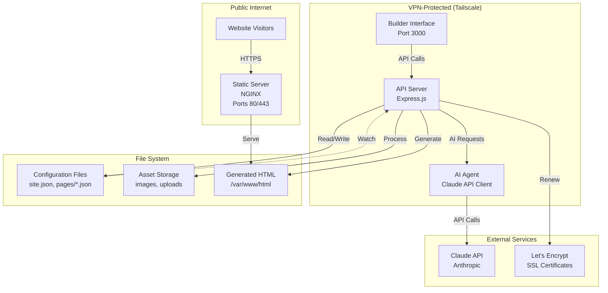
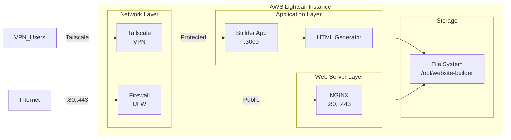
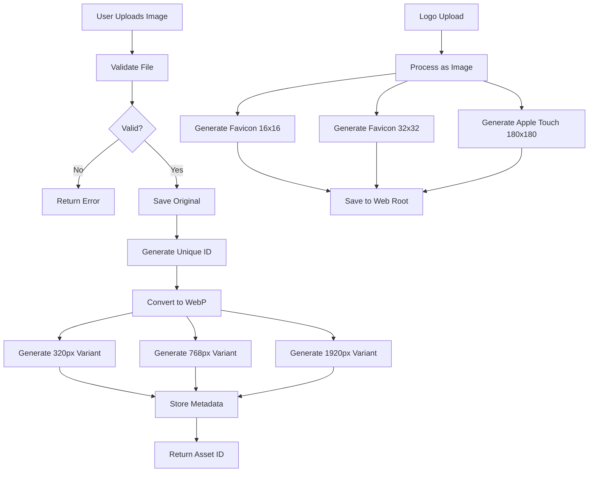
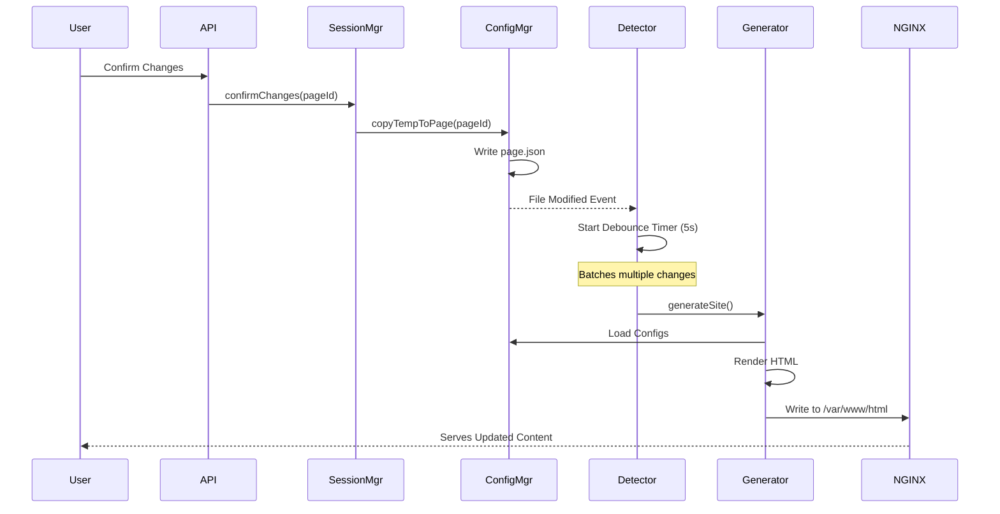
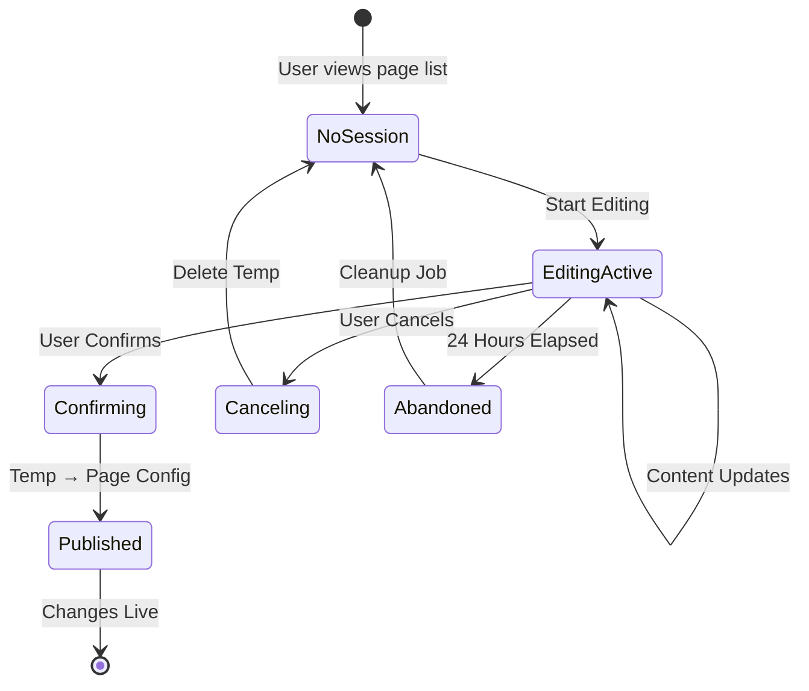

# Technical Design Document

## Overview

The AI Website Builder is a two-component system designed for small business owners to create and manage professional websites through AI-assisted content creation. The system consists of:

1. **Builder Interface**: A VPN-protected web application for content management and AI interaction
2. **Static Server**: A public-facing NGINX server that serves generated HTML pages

The system is optimized to run on AWS Lightsail (1 CPU, 1GB RAM) with a target operational cost of $12-30/month. The architecture emphasizes simplicity, security, and resource efficiency while providing powerful AI-assisted content creation capabilities.

### Design Principles

- **Security First**: Builder interface protected behind Tailscale VPN; public content served separately
- **Resource Efficiency**: Designed for minimal resource footprint (1GB RAM, 1 CPU)
- **Cost Optimization**: API rate limiting and request queuing to control Claude API costs
- **Separation of Concerns**: Clear boundaries between builder, generator, and server components
- **Configuration-Driven**: All site data stored in JSON files; HTML generated from configuration
- **Fail-Safe Operations**: Temporary files for editing; changes confirmed before publishing

## Architecture

### High-Level Architecture



### Component Architecture

The system is organized into distinct layers:

1. **Presentation Layer**: React-based Builder Interface (VPN-protected)
2. **Application Layer**: Express.js API server with business logic
3. **Integration Layer**: Claude API client, file system operations
4. **Storage Layer**: JSON configuration files, static assets
5. **Serving Layer**: NGINX static file server (public)

### Deployment Architecture




## Components and Interfaces

### 1. Builder Interface (Frontend)

**Technology**: React with TypeScript, Vite for bundling

**Responsibilities**:
- Render onboarding wizard for new users
- Provide AI chat interface for content creation
- Display page editor with preview capabilities
- Show status dashboard and system health
- Handle image uploads and asset management UI
- Provide responsive preview modes (mobile, tablet, desktop)

**Key Modules**:

```typescript
// Core interfaces
interface BuilderState {
  currentPage: string | null;
  editingSession: EditingSession | null;
  siteConfig: SiteConfig;
  systemStatus: SystemStatus;
}

interface EditingSession {
  pageId: string;
  tempConfig: PageConfig;
  conversationHistory: Message[];
  startedAt: Date;
}

// Main components
- OnboardingWizard: Multi-step form for initial setup
- PageEditor: Main editing interface with AI chat
- PreviewPanel: Responsive preview with device switching
- StatusDashboard: System health and metrics display
- AssetManager: Image upload and management UI
- VersionHistory: Version list and rollback interface
```

**API Communication**:
- RESTful API calls to Express.js backend
- WebSocket connection for real-time AI responses
- File upload via multipart/form-data

### 2. API Server (Backend)

**Technology**: Node.js with Express.js, TypeScript

**Responsibilities**:
- Handle all Builder Interface API requests
- Manage editing sessions and temporary configurations
- Coordinate AI content generation
- Trigger HTML regeneration on config changes
- Process and optimize uploaded images
- Manage version control and backups
- Monitor system health and API usage

**Key Modules**:

```typescript
// Express routes
app.post('/api/onboarding', onboardingController);
app.get('/api/pages', listPagesController);
app.post('/api/pages/:id/edit', startEditingController);
app.post('/api/pages/:id/ai-chat', aiChatController);
app.post('/api/pages/:id/confirm', confirmChangesController);
app.post('/api/assets/upload', uploadAssetController);
app.get('/api/status', statusController);
app.post('/api/pages/:id/rollback', rollbackController);

// Core services
- SessionManager: Manages editing sessions and temp files
- ConfigManager: Reads/writes configuration files
- AIAgent: Interfaces with Claude API
- RateLimiter: Controls API request rate and queuing
- StaticGenerator: Generates HTML from configurations
- AssetProcessor: Optimizes and processes images
- VersionManager: Handles backups and rollbacks
- ConfigDetector: Watches for file changes
```


### 3. AI Agent

**Technology**: Claude API SDK (@anthropic-ai/sdk)

**Responsibilities**:
- Send user messages to Claude API with context
- Maintain conversation history for context
- Generate content suggestions based on user input
- Ask clarifying questions to understand intent
- Refine content based on user feedback

**Implementation**:

```typescript
class AIAgent {
  private client: Anthropic;
  private rateLimiter: RateLimiter;
  
  async generateContent(
    conversationHistory: Message[],
    userMessage: string,
    pageContext: PageContext
  ): Promise<AIResponse> {
    // Build system prompt with page context
    const systemPrompt = this.buildSystemPrompt(pageContext);
    
    // Add user message to history
    const messages = [...conversationHistory, {
      role: 'user',
      content: userMessage
    }];
    
    // Rate limit check
    await this.rateLimiter.acquire();
    
    try {
      // Call Claude API with retry logic
      const response = await this.callWithRetry({
        model: 'claude-3-5-sonnet-20241022',
        max_tokens: 4096,
        system: systemPrompt,
        messages: messages
      });
      
      return {
        content: response.content[0].text,
        tokensUsed: response.usage.input_tokens + response.usage.output_tokens
      };
    } catch (error) {
      throw new AIAgentError('Failed to generate content', error);
    }
  }
  
  private async callWithRetry(params: any, attempt = 1): Promise<any> {
    try {
      return await this.client.messages.create(params);
    } catch (error) {
      if (attempt >= 3) throw error;
      if (this.isTransientError(error)) {
        await this.sleep(Math.pow(2, attempt) * 1000);
        return this.callWithRetry(params, attempt + 1);
      }
      throw error;
    }
  }
}
```

### 4. Rate Limiter

**Responsibilities**:
- Track API requests per minute
- Queue requests when rate limit is approached
- Process queue with FIFO ordering
- Track monthly token usage
- Alert when usage thresholds are exceeded

**Implementation**:

```typescript
class RateLimiter {
  private requestQueue: QueuedRequest[] = [];
  private requestTimestamps: number[] = [];
  private monthlyTokens: number = 0;
  private readonly MAX_REQUESTS_PER_MINUTE = 10;
  private readonly MONTHLY_TOKEN_THRESHOLD = 1000000;
  
  async acquire(): Promise<void> {
    const now = Date.now();
    
    // Remove timestamps older than 1 minute
    this.requestTimestamps = this.requestTimestamps.filter(
      ts => now - ts < 60000
    );
    
    // Check if under rate limit
    if (this.requestTimestamps.length < this.MAX_REQUESTS_PER_MINUTE) {
      this.requestTimestamps.push(now);
      return;
    }
    
    // Queue the request
    return new Promise((resolve) => {
      this.requestQueue.push({ resolve, timestamp: now });
      this.processQueue();
    });
  }
  
  private processQueue(): void {
    setInterval(() => {
      const now = Date.now();
      this.requestTimestamps = this.requestTimestamps.filter(
        ts => now - ts < 60000
      );
      
      while (
        this.requestQueue.length > 0 &&
        this.requestTimestamps.length < this.MAX_REQUESTS_PER_MINUTE
      ) {
        const request = this.requestQueue.shift()!;
        this.requestTimestamps.push(Date.now());
        request.resolve();
      }
    }, 1000);
  }
  
  trackTokenUsage(tokens: number): void {
    this.monthlyTokens += tokens;
    if (this.monthlyTokens > this.MONTHLY_TOKEN_THRESHOLD) {
      this.notifyThresholdExceeded();
    }
  }
}
```


### 5. Session Manager

**Responsibilities**:
- Create and manage editing sessions
- Handle temporary configuration files
- Preserve original configs until confirmation
- Clean up abandoned sessions after 24 hours
- Restore incomplete sessions

**Implementation**:

```typescript
class SessionManager {
  private configManager: ConfigManager;
  private sessions: Map<string, EditingSession> = new Map();
  
  async startEditing(pageId: string): Promise<EditingSession> {
    // Load current page config
    const pageConfig = await this.configManager.loadPageConfig(pageId);
    
    // Create temp config
    const tempConfig = { ...pageConfig };
    await this.configManager.saveTempConfig(pageId, tempConfig);
    
    // Create session
    const session: EditingSession = {
      pageId,
      tempConfig,
      conversationHistory: [],
      startedAt: new Date()
    };
    
    this.sessions.set(pageId, session);
    return session;
  }
  
  async confirmChanges(pageId: string): Promise<void> {
    const session = this.sessions.get(pageId);
    if (!session) throw new Error('No active session');
    
    // Copy temp config to page config
    await this.configManager.copyTempToPage(pageId);
    
    // Delete temp config
    await this.configManager.deleteTempConfig(pageId);
    
    // Remove session
    this.sessions.delete(pageId);
  }
  
  async cancelChanges(pageId: string): Promise<void> {
    // Delete temp config, preserve page config
    await this.configManager.deleteTempConfig(pageId);
    this.sessions.delete(pageId);
  }
  
  async cleanupAbandonedSessions(): Promise<void> {
    const now = Date.now();
    const twentyFourHours = 24 * 60 * 60 * 1000;
    
    for (const [pageId, session] of this.sessions) {
      if (now - session.startedAt.getTime() > twentyFourHours) {
        await this.configManager.deleteTempConfig(pageId);
        this.sessions.delete(pageId);
      }
    }
  }
}
```

### 6. Config Manager

**Responsibilities**:
- Read and write configuration files
- Validate JSON structure
- Manage file paths and organization
- Ensure atomic file operations

**File Structure**:
```
/opt/website-builder/
├── config/
│   ├── site.json                 # Site-wide configuration
│   └── pages/
│       ├── home.json             # Page configurations
│       ├── about.json
│       ├── services.json
│       ├── contact.json
│       ├── home.temp.json        # Temporary editing files
│       └── about.temp.json
├── assets/
│   ├── uploads/                  # Original uploaded files
│   └── processed/                # Optimized images
│       ├── 320/
│       ├── 768/
│       └── 1920/
└── versions/
    └── pages/
        ├── home/
        │   ├── v1.json
        │   ├── v2.json
        │   └── v3.json
        └── about/
            └── v1.json
```


### 7. Static Generator

**Responsibilities**:
- Generate HTML from configuration files
- Apply site-wide branding and navigation
- Generate SEO meta tags
- Create responsive HTML
- Generate sitemap.xml
- Trigger regeneration on config changes

**Implementation**:

```typescript
class StaticGenerator {
  private configManager: ConfigManager;
  private templateEngine: TemplateEngine;
  
  async generateSite(): Promise<void> {
    const siteConfig = await this.configManager.loadSiteConfig();
    const pages = await this.configManager.listPages();
    
    // Generate each page
    for (const pageId of pages) {
      await this.generatePage(pageId, siteConfig);
    }
    
    // Generate sitemap
    await this.generateSitemap(pages, siteConfig);
  }
  
  async generatePage(pageId: string, siteConfig: SiteConfig): Promise<void> {
    const pageConfig = await this.configManager.loadPageConfig(pageId);
    
    // Build HTML
    const html = this.templateEngine.render('page', {
      site: siteConfig,
      page: pageConfig,
      navigation: this.buildNavigation(siteConfig),
      seo: this.generateSEOTags(pageConfig, siteConfig)
    });
    
    // Write to public directory
    const outputPath = `/var/www/html/${pageId}.html`;
    await fs.writeFile(outputPath, html);
  }
  
  private generateSEOTags(page: PageConfig, site: SiteConfig): SEOTags {
    return {
      title: `${page.title} | ${site.businessName}`,
      description: this.extractDescription(page.content),
      canonical: `https://${site.domain}/${page.id}.html`,
      ogTitle: page.title,
      ogDescription: this.extractDescription(page.content),
      ogImage: page.featuredImage || site.logo,
      viewport: 'width=device-width, initial-scale=1.0'
    };
  }
  
  private async generateSitemap(pages: string[], site: SiteConfig): Promise<void> {
    const urls = await Promise.all(
      pages.map(async (pageId) => {
        const config = await this.configManager.loadPageConfig(pageId);
        return {
          loc: `https://${site.domain}/${pageId}.html`,
          lastmod: config.lastModified,
          priority: pageId === 'home' ? '1.0' : '0.8'
        };
      })
    );
    
    const sitemap = this.buildSitemapXML(urls);
    await fs.writeFile('/var/www/html/sitemap.xml', sitemap);
  }
}
```

### 8. Asset Processor

**Responsibilities**:
- Validate uploaded images
- Convert images to WebP format
- Generate responsive image variants
- Create favicon from logo
- Optimize file sizes

**Implementation**:

```typescript
class AssetProcessor {
  private readonly SIZES = [320, 768, 1920];
  private readonly MAX_FILE_SIZE = 5 * 1024 * 1024; // 5MB
  
  async processImage(file: UploadedFile): Promise<ProcessedAsset> {
    // Validate file
    if (file.size > this.MAX_FILE_SIZE) {
      throw new Error('File exceeds 5MB limit');
    }
    
    if (!this.isValidImageFormat(file.mimetype)) {
      throw new Error('Invalid image format');
    }
    
    // Generate unique filename
    const filename = `${uuidv4()}.webp`;
    
    // Save original
    const originalPath = `/opt/website-builder/assets/uploads/${file.originalname}`;
    await file.mv(originalPath);
    
    // Generate responsive variants
    const variants: ImageVariant[] = [];
    for (const width of this.SIZES) {
      const outputPath = `/opt/website-builder/assets/processed/${width}/${filename}`;
      await sharp(originalPath)
        .resize(width, null, { withoutEnlargement: true })
        .webp({ quality: 85 })
        .toFile(outputPath);
      
      variants.push({ width, path: outputPath });
    }
    
    return {
      id: filename,
      originalPath,
      variants,
      altText: ''
    };
  }
  
  async generateFavicon(logoPath: string): Promise<void> {
    const sizes = [16, 32, 180];
    
    // Generate favicon.ico (multi-size)
    await sharp(logoPath)
      .resize(32, 32)
      .toFile('/var/www/html/favicon.ico');
    
    // Generate apple-touch-icon
    await sharp(logoPath)
      .resize(180, 180)
      .toFile('/var/www/html/apple-touch-icon.png');
  }
}
```


### 9. Config Detector

**Responsibilities**:
- Monitor configuration files for changes
- Trigger HTML regeneration on modifications
- Batch multiple simultaneous changes
- Ignore temporary config files

**Implementation**:

```typescript
class ConfigDetector {
  private watcher: FSWatcher;
  private generator: StaticGenerator;
  private debounceTimer: NodeJS.Timeout | null = null;
  private readonly DEBOUNCE_MS = 5000;
  
  start(): void {
    this.watcher = chokidar.watch([
      '/opt/website-builder/config/site.json',
      '/opt/website-builder/config/pages/*.json'
    ], {
      ignored: /\.temp\.json$/,
      persistent: true
    });
    
    this.watcher.on('change', (path) => {
      this.scheduleRegeneration();
    });
  }
  
  private scheduleRegeneration(): void {
    // Clear existing timer
    if (this.debounceTimer) {
      clearTimeout(this.debounceTimer);
    }
    
    // Schedule regeneration after debounce period
    this.debounceTimer = setTimeout(async () => {
      try {
        await this.generator.generateSite();
        console.log('Site regenerated successfully');
      } catch (error) {
        console.error('Failed to regenerate site:', error);
      }
    }, this.DEBOUNCE_MS);
  }
  
  stop(): void {
    if (this.watcher) {
      this.watcher.close();
    }
  }
}
```

### 10. Version Manager

**Responsibilities**:
- Create backups before modifications
- Maintain last 10 versions per page
- Provide version listing
- Restore previous versions

**Implementation**:

```typescript
class VersionManager {
  private readonly MAX_VERSIONS = 10;
  
  async createBackup(pageId: string): Promise<void> {
    const pageConfig = await this.configManager.loadPageConfig(pageId);
    const versionDir = `/opt/website-builder/versions/pages/${pageId}`;
    
    // Ensure directory exists
    await fs.mkdir(versionDir, { recursive: true });
    
    // Get existing versions
    const versions = await this.listVersions(pageId);
    
    // Create new version
    const versionNumber = versions.length + 1;
    const versionPath = `${versionDir}/v${versionNumber}.json`;
    await fs.writeFile(versionPath, JSON.stringify(pageConfig, null, 2));
    
    // Cleanup old versions if exceeding limit
    if (versions.length >= this.MAX_VERSIONS) {
      const oldestVersion = versions[0];
      await fs.unlink(`${versionDir}/${oldestVersion}`);
    }
  }
  
  async listVersions(pageId: string): Promise<Version[]> {
    const versionDir = `/opt/website-builder/versions/pages/${pageId}`;
    
    try {
      const files = await fs.readdir(versionDir);
      const versions = await Promise.all(
        files
          .filter(f => f.endsWith('.json'))
          .sort()
          .map(async (file) => {
            const stat = await fs.stat(`${versionDir}/${file}`);
            return {
              filename: file,
              timestamp: stat.mtime,
              number: parseInt(file.match(/v(\d+)\.json/)?.[1] || '0')
            };
          })
      );
      
      return versions.sort((a, b) => b.number - a.number);
    } catch (error) {
      return [];
    }
  }
  
  async restoreVersion(pageId: string, versionNumber: number): Promise<void> {
    const versionPath = `/opt/website-builder/versions/pages/${pageId}/v${versionNumber}.json`;
    const pageConfigPath = `/opt/website-builder/config/pages/${pageId}.json`;
    
    // Create backup of current version first
    await this.createBackup(pageId);
    
    // Restore the selected version
    const versionContent = await fs.readFile(versionPath, 'utf-8');
    await fs.writeFile(pageConfigPath, versionContent);
  }
}
```


### 11. Template Generator

**Responsibilities**:
- Generate legal page templates
- Populate templates with business information
- Provide customization capabilities

**Implementation**:

```typescript
class TemplateGenerator {
  generatePrivacyPolicy(siteConfig: SiteConfig): string {
    return `
# Privacy Policy

Last updated: ${new Date().toLocaleDateString()}

## Business Information

${siteConfig.businessName} ("we", "our", or "us") operates ${siteConfig.domain}.

## Information We Collect

[Customizable section based on site features]

## Contact Information

${siteConfig.email}
${siteConfig.phone}
${siteConfig.address}

## Your Rights

[Standard privacy rights section]
    `.trim();
  }
  
  generateTermsOfService(siteConfig: SiteConfig): string {
    return `
# Terms of Service

Last updated: ${new Date().toLocaleDateString()}

## Agreement to Terms

By accessing ${siteConfig.domain}, you agree to these Terms of Service.

## Business Information

Legal Name: ${siteConfig.legalName}
Contact: ${siteConfig.email}

[Additional standard terms sections]
    `.trim();
  }
}
```

## Data Models

### Site Configuration (site.json)

```typescript
interface SiteConfig {
  // Business Information
  businessName: string;
  legalName: string;
  industry: string;
  description: string;
  
  // Contact Information
  email: string;
  phone: string;
  address: {
    street: string;
    city: string;
    state: string;
    zip: string;
    country: string;
  };
  
  // Branding
  logo: string;                    // Path to logo file
  favicon: string;                 // Path to favicon
  primaryColor: string;            // Hex color
  secondaryColor: string;          // Hex color
  fontFamily: string;
  
  // Domain and URLs
  domain: string;
  
  // Navigation
  navigation: NavigationItem[];
  
  // Legal
  privacyPolicyEnabled: boolean;
  termsOfServiceEnabled: boolean;
  
  // Metadata
  createdAt: string;               // ISO 8601 timestamp
  lastModified: string;            // ISO 8601 timestamp
}

interface NavigationItem {
  label: string;
  pageId: string;
  order: number;
}
```


### Page Configuration (pages/[page-name].json)

```typescript
interface PageConfig {
  // Identification
  id: string;                      // Unique page identifier (slug)
  title: string;                   // Page title
  
  // Content
  sections: ContentSection[];
  
  // SEO
  metaDescription: string;
  keywords: string[];
  featuredImage?: string;
  
  // Page Intent (captured during AI interaction)
  intent: {
    primaryGoal: string;           // e.g., "Generate leads", "Provide information"
    targetAudience: string;        // e.g., "Small business owners"
    callsToAction: string[];       // e.g., ["Contact us", "Schedule consultation"]
  };
  
  // Metadata
  createdAt: string;               // ISO 8601 timestamp
  lastModified: string;            // ISO 8601 timestamp
  version: number;
}

interface ContentSection {
  type: 'hero' | 'text' | 'image' | 'gallery' | 'contact-form' | 'cta';
  id: string;
  order: number;
  content: Record<string, any>;    // Type-specific content
}

// Example section types
interface HeroSection extends ContentSection {
  type: 'hero';
  content: {
    headline: string;
    subheadline: string;
    backgroundImage?: string;
    ctaText?: string;
    ctaLink?: string;
  };
}

interface TextSection extends ContentSection {
  type: 'text';
  content: {
    heading?: string;
    body: string;                  // Markdown or HTML
  };
}

interface ImageSection extends ContentSection {
  type: 'image';
  content: {
    imageId: string;
    altText: string;
    caption?: string;
    alignment: 'left' | 'center' | 'right';
  };
}
```

### Temporary Configuration (pages/[page-name].temp.json)

```typescript
interface TempConfig extends PageConfig {
  // Additional fields for editing session
  sessionId: string;
  startedAt: string;               // ISO 8601 timestamp
  conversationHistory: Message[];
}

interface Message {
  role: 'user' | 'assistant';
  content: string;
  timestamp: string;               // ISO 8601 timestamp
}
```

### Asset Metadata

```typescript
interface ProcessedAsset {
  id: string;                      // Unique identifier
  originalPath: string;            // Path to original upload
  originalFilename: string;
  mimetype: string;
  size: number;                    // Bytes
  variants: ImageVariant[];
  altText: string;
  uploadedAt: string;              // ISO 8601 timestamp
}

interface ImageVariant {
  width: number;
  path: string;
  size: number;                    // Bytes
}
```


### System Status

```typescript
interface SystemStatus {
  staticServer: {
    status: 'running' | 'stopped' | 'error';
    uptime: number;                // Seconds
  };
  
  sslCertificate: {
    status: 'valid' | 'expiring' | 'expired';
    expiresAt: string;             // ISO 8601 timestamp
    daysUntilExpiry: number;
  };
  
  apiUsage: {
    requestsThisMinute: number;
    requestsToday: number;
    tokensThisMonth: number;
    estimatedCost: number;         // USD
  };
  
  lastBackup: {
    timestamp: string;             // ISO 8601 timestamp
    success: boolean;
  };
  
  diskUsage: {
    total: number;                 // Bytes
    used: number;                  // Bytes
    available: number;             // Bytes
  };
}
```

## API Integration Patterns

### Claude API Integration

**Configuration**:
```typescript
const anthropic = new Anthropic({
  apiKey: process.env.ANTHROPIC_API_KEY,
});

const API_CONFIG = {
  model: 'claude-3-5-sonnet-20241022',
  maxTokens: 4096,
  temperature: 0.7,
};
```

**Request Pattern with Rate Limiting**:

```typescript
async function makeAIRequest(
  messages: Message[],
  systemPrompt: string
): Promise<AIResponse> {
  // Acquire rate limit token
  await rateLimiter.acquire();
  
  try {
    const response = await anthropic.messages.create({
      model: API_CONFIG.model,
      max_tokens: API_CONFIG.maxTokens,
      system: systemPrompt,
      messages: messages.map(m => ({
        role: m.role,
        content: m.content
      }))
    });
    
    // Track token usage
    const tokensUsed = response.usage.input_tokens + response.usage.output_tokens;
    rateLimiter.trackTokenUsage(tokensUsed);
    
    // Log request
    logger.info('AI request completed', {
      tokensUsed,
      model: API_CONFIG.model
    });
    
    return {
      content: response.content[0].text,
      tokensUsed
    };
  } catch (error) {
    if (error.status === 429) {
      // Rate limit error - queue for retry
      return rateLimiter.queueRequest(() => 
        makeAIRequest(messages, systemPrompt)
      );
    }
    throw error;
  }
}
```

**Retry Logic with Exponential Backoff**:

```typescript
async function callWithRetry<T>(
  fn: () => Promise<T>,
  maxAttempts: number = 3
): Promise<T> {
  let lastError: Error;
  
  for (let attempt = 1; attempt <= maxAttempts; attempt++) {
    try {
      return await fn();
    } catch (error) {
      lastError = error;
      
      // Don't retry on non-transient errors
      if (!isTransientError(error)) {
        throw error;
      }
      
      // Don't wait after last attempt
      if (attempt < maxAttempts) {
        const delayMs = Math.pow(2, attempt) * 1000;
        await sleep(delayMs);
      }
    }
  }
  
  throw new Error(`Failed after ${maxAttempts} attempts: ${lastError.message}`);
}

function isTransientError(error: any): boolean {
  return (
    error.status === 429 ||        // Rate limit
    error.status === 500 ||        // Server error
    error.status === 502 ||        // Bad gateway
    error.status === 503 ||        // Service unavailable
    error.status === 504 ||        // Gateway timeout
    error.code === 'ECONNRESET' || // Connection reset
    error.code === 'ETIMEDOUT'     // Timeout
  );
}
```


### System Prompts for AI Agent

**Content Generation Prompt**:
```typescript
function buildContentGenerationPrompt(pageContext: PageContext): string {
  return `You are an expert website content writer helping a small business owner create professional web content.

Business Context:
- Business Name: ${pageContext.businessName}
- Industry: ${pageContext.industry}
- Description: ${pageContext.businessDescription}

Page Context:
- Page: ${pageContext.pageTitle}
- Purpose: ${pageContext.intent?.primaryGoal || 'Not specified'}
- Target Audience: ${pageContext.intent?.targetAudience || 'General public'}

Your role:
1. Ask clarifying questions to understand the page's purpose and content needs
2. Generate professional, engaging content appropriate for the business and audience
3. Suggest specific sections (hero, text, images, CTAs) that would work well
4. Refine content based on user feedback
5. Keep content concise and focused on the business goals

Guidelines:
- Use a professional but approachable tone
- Focus on benefits and value propositions
- Include clear calls-to-action where appropriate
- Ensure content is SEO-friendly
- Keep paragraphs short and scannable`;
}
```

## File System Organization and Security

### Directory Structure

```
/opt/website-builder/              # Application root (protected)
├── app/                           # Application code
│   ├── server.js                  # Express server
│   ├── routes/                    # API routes
│   ├── services/                  # Business logic
│   └── public/                    # Builder interface static files
├── config/                        # Configuration files (protected)
│   ├── site.json
│   └── pages/
│       ├── *.json
│       └── *.temp.json
├── assets/                        # Asset storage (protected)
│   ├── uploads/
│   └── processed/
├── versions/                      # Version backups (protected)
└── logs/                          # Application logs (protected)

/var/www/html/                     # Public web root (NGINX serves from here)
├── index.html                     # Generated pages
├── about.html
├── services.html
├── contact.html
├── privacy.html
├── terms.html
├── sitemap.xml
├── robots.txt
├── favicon.ico
├── apple-touch-icon.png
└── assets/                        # Public assets (symlink to processed)
    ├── 320/
    ├── 768/
    └── 1920/
```

### Security Boundaries

**Protected Resources** (accessible only via Tailscale):
- `/opt/website-builder/` - All application files and configuration
- Builder Interface on port 3000
- API endpoints

**Public Resources** (accessible to internet):
- `/var/www/html/` - Generated HTML and public assets only
- NGINX on ports 80/443

**File Permissions**:
```bash
# Application directory - restricted
chown -R www-data:www-data /opt/website-builder
chmod 750 /opt/website-builder
chmod 640 /opt/website-builder/config/*.json

# Public directory - readable
chown -R www-data:www-data /var/www/html
chmod 755 /var/www/html
chmod 644 /var/www/html/*.html
```

### Environment Variables

```bash
# .env file (stored in /opt/website-builder/)
ANTHROPIC_API_KEY=sk-ant-...
NODE_ENV=production
PORT=3000
DOMAIN=example.com
SSL_EMAIL=admin@example.com

# Security
SESSION_SECRET=<random-secret>
ALLOWED_ORIGINS=https://example.com

# Paths
CONFIG_DIR=/opt/website-builder/config
ASSETS_DIR=/opt/website-builder/assets
PUBLIC_DIR=/var/www/html
VERSIONS_DIR=/opt/website-builder/versions
LOG_DIR=/opt/website-builder/logs

# Rate Limiting
MAX_REQUESTS_PER_MINUTE=10
MONTHLY_TOKEN_THRESHOLD=1000000

# Monitoring
LOG_LEVEL=info
LOG_ROTATION_SIZE=100MB
LOG_RETENTION_DAYS=30
```


## Image Processing Pipeline

### Processing Flow



### Image Optimization Strategy

**WebP Conversion**:
- Quality: 85% (balance between size and quality)
- Lossless for logos and graphics with transparency
- Lossy for photographs

**Responsive Variants**:
- 320px: Mobile devices (portrait)
- 768px: Tablets and small laptops
- 1920px: Desktop and high-resolution displays

**HTML Picture Element**:
```html
<picture>
  <source 
    media="(max-width: 480px)" 
    srcset="/assets/320/image-id.webp"
  >
  <source 
    media="(max-width: 1024px)" 
    srcset="/assets/768/image-id.webp"
  >
  <source 
    media="(min-width: 1025px)" 
    srcset="/assets/1920/image-id.webp"
  >
  
</picture>
```

### Storage Optimization

**Cleanup Strategy**:
- Track image references in page configurations
- Periodically scan for orphaned images (not referenced in any config)
- Delete orphaned images older than 30 days
- Keep original uploads for potential reprocessing

## Configuration Change Detection and HTML Regeneration

### Change Detection Flow



### Debouncing Strategy

**Why Debounce?**
- Multiple pages might be updated in quick succession
- Avoid regenerating the entire site multiple times
- Reduce CPU usage and disk I/O

**Implementation**:
- 5-second debounce window
- Timer resets on each new change
- Site regenerates once after changes stop

### Atomic File Operations

**Ensuring Consistency**:
```typescript
async function atomicWrite(path: string, content: string): Promise<void> {
  const tempPath = `${path}.tmp`;
  
  // Write to temporary file
  await fs.writeFile(tempPath, content);
  
  // Atomic rename
  await fs.rename(tempPath, path);
}
```

This prevents partial writes from triggering regeneration with incomplete data.


## Session Management and State Handling

### Session Lifecycle



### Session State Management

**In-Memory Session Store**:
```typescript
class SessionStore {
  private sessions: Map<string, EditingSession> = new Map();
  
  // Session operations
  create(pageId: string, config: PageConfig): EditingSession;
  get(pageId: string): EditingSession | null;
  update(pageId: string, updates: Partial<EditingSession>): void;
  delete(pageId: string): void;
  
  // Cleanup
  getAbandonedSessions(thresholdHours: number): EditingSession[];
}
```

**Session Persistence**:
- Active sessions stored in memory for fast access
- Temp config files provide persistence across server restarts
- On startup, restore sessions from existing temp files

**Concurrent Editing Prevention**:
```typescript
async function startEditing(pageId: string, userId: string): Promise<EditingSession> {
  const existingSession = sessionStore.get(pageId);
  
  if (existingSession) {
    throw new Error('Page is already being edited');
  }
  
  // Create new session
  const session = await sessionManager.startEditing(pageId);
  session.userId = userId;
  session.lockedAt = new Date();
  
  return session;
}
```

### Conversation History Management

**Storage Strategy**:
- Store in temp config during active session
- Limit to last 20 messages to control token usage
- Include in AI requests for context

**Context Window Management**:
```typescript
function buildConversationContext(
  history: Message[],
  maxMessages: number = 20
): Message[] {
  // Keep most recent messages
  const recentMessages = history.slice(-maxMessages);
  
  // Always include first message if it contains important context
  if (history.length > maxMessages && history[0].role === 'user') {
    return [history[0], ...recentMessages.slice(1)];
  }
  
  return recentMessages;
}
```

## SEO and Legal Page Generation

### SEO Meta Tag Generation

**Title Tag Strategy**:
```typescript
function generateTitle(page: PageConfig, site: SiteConfig): string {
  // Home page: "Business Name - Industry"
  if (page.id === 'home') {
    return `${site.businessName} - ${site.industry}`;
  }
  
  // Other pages: "Page Title | Business Name"
  return `${page.title} | ${site.businessName}`;
}
```

**Meta Description Extraction**:
```typescript
function extractDescription(content: ContentSection[]): string {
  // Find first text section
  const textSection = content.find(s => s.type === 'text' || s.type === 'hero');
  
  if (!textSection) {
    return '';
  }
  
  // Extract first 160 characters
  const text = textSection.content.body || textSection.content.subheadline || '';
  const plainText = stripHTML(text);
  
  return plainText.substring(0, 160).trim() + '...';
}
```

**Open Graph Tags**:
```html
<meta property="og:title" content="Page Title | Business Name">
<meta property="og:description" content="Page description...">
<meta property="og:image" content="https://example.com/assets/featured.webp">
<meta property="og:url" content="https://example.com/page.html">
<meta property="og:type" content="website">
<meta property="og:site_name" content="Business Name">
```

### Structured Data (JSON-LD)

**Local Business Schema**:
```typescript
function generateLocalBusinessSchema(site: SiteConfig): object {
  return {
    "@context": "https://schema.org",
    "@type": "LocalBusiness",
    "name": site.businessName,
    "description": site.description,
    "url": `https://${site.domain}`,
    "telephone": site.phone,
    "email": site.email,
    "address": {
      "@type": "PostalAddress",
      "streetAddress": site.address.street,
      "addressLocality": site.address.city,
      "addressRegion": site.address.state,
      "postalCode": site.address.zip,
      "addressCountry": site.address.country
    }
  };
}
```


### Legal Page Generation

**Privacy Policy Template**:
```typescript
function generatePrivacyPolicy(site: SiteConfig): PageConfig {
  const sections: ContentSection[] = [
    {
      type: 'text',
      id: 'intro',
      order: 1,
      content: {
        heading: 'Privacy Policy',
        body: `
Last updated: ${new Date().toLocaleDateString()}

${site.businessName} ("we", "our", or "us") is committed to protecting your privacy. 
This Privacy Policy explains how we collect, use, and safeguard your information when 
you visit our website ${site.domain}.
        `
      }
    },
    {
      type: 'text',
      id: 'information-collection',
      order: 2,
      content: {
        heading: 'Information We Collect',
        body: `
We may collect information that you provide directly to us, including:
- Name and contact information
- Email address
- Phone number
- Any other information you choose to provide

[Customizable based on site features]
        `
      }
    },
    {
      type: 'text',
      id: 'contact',
      order: 3,
      content: {
        heading: 'Contact Us',
        body: `
If you have questions about this Privacy Policy, please contact us:

Email: ${site.email}
Phone: ${site.phone}
Address: ${formatAddress(site.address)}
        `
      }
    }
  ];
  
  return {
    id: 'privacy',
    title: 'Privacy Policy',
    sections,
    metaDescription: `Privacy Policy for ${site.businessName}`,
    keywords: ['privacy', 'policy', 'data protection'],
    intent: {
      primaryGoal: 'Legal compliance',
      targetAudience: 'All visitors',
      callsToAction: []
    },
    createdAt: new Date().toISOString(),
    lastModified: new Date().toISOString(),
    version: 1
  };
}
```

**Terms of Service Template**:
```typescript
function generateTermsOfService(site: SiteConfig): PageConfig {
  const sections: ContentSection[] = [
    {
      type: 'text',
      id: 'intro',
      order: 1,
      content: {
        heading: 'Terms of Service',
        body: `
Last updated: ${new Date().toLocaleDateString()}

Please read these Terms of Service carefully before using ${site.domain} 
operated by ${site.legalName}.

By accessing or using our website, you agree to be bound by these Terms.
        `
      }
    },
    {
      type: 'text',
      id: 'use-license',
      order: 2,
      content: {
        heading: 'Use License',
        body: `
Permission is granted to temporarily access the materials on ${site.businessName}'s 
website for personal, non-commercial transitory viewing only.

[Standard terms sections]
        `
      }
    },
    {
      type: 'text',
      id: 'contact',
      order: 3,
      content: {
        heading: 'Contact Information',
        body: `
For questions about these Terms, contact:

${site.legalName}
Email: ${site.email}
Phone: ${site.phone}
        `
      }
    }
  ];
  
  return {
    id: 'terms',
    title: 'Terms of Service',
    sections,
    metaDescription: `Terms of Service for ${site.businessName}`,
    keywords: ['terms', 'service', 'legal'],
    intent: {
      primaryGoal: 'Legal compliance',
      targetAudience: 'All visitors',
      callsToAction: []
    },
    createdAt: new Date().toISOString(),
    lastModified: new Date().toISOString(),
    version: 1
  };
}
```

### Sitemap Generation

```typescript
function generateSitemap(pages: PageConfig[], site: SiteConfig): string {
  const urls = pages.map(page => {
    const priority = page.id === 'home' ? '1.0' : '0.8';
    const changefreq = page.id === 'home' ? 'weekly' : 'monthly';
    
    return `
  <url>
    <loc>https://${site.domain}/${page.id}.html</loc>
    <lastmod>${page.lastModified}</lastmod>
    <changefreq>${changefreq}</changefreq>
    <priority>${priority}</priority>
  </url>`;
  }).join('');
  
  return `<?xml version="1.0" encoding="UTF-8"?>
<urlset xmlns="http://www.sitemaps.org/schemas/sitemap/0.9">
${urls}
</urlset>`;
}
```

### Robots.txt Generation

```typescript
function generateRobotsTxt(site: SiteConfig): string {
  return `User-agent: *
Allow: /

Sitemap: https://${site.domain}/sitemap.xml`;
}
```


## Correctness Properties

*A property is a characteristic or behavior that should hold true across all valid executions of a system—essentially, a formal statement about what the system should do. Properties serve as the bridge between human-readable specifications and machine-verifiable correctness guarantees.*

### Property Reflection

After analyzing all 150 acceptance criteria, I identified 95 testable properties. Through reflection, I've consolidated these to eliminate redundancy:

**Consolidations Made**:
- Session management properties (11.1-11.5, 12.3-12.5) consolidated into comprehensive session lifecycle properties
- Image processing properties (14.1-14.5) combined into single image optimization property
- Favicon generation properties (15.1-15.3, 15.5) combined into single favicon generation property
- Rate limiting properties (18.1-18.5, 20.1-20.3) consolidated into comprehensive rate limiting properties
- HTML generation properties (21.1-21.4, 22.1-22.5) consolidated into comprehensive HTML generation properties
- Sitemap properties (23.1-23.4) combined into single sitemap generation property
- Logging properties (30.1-30.3) combined into comprehensive logging property

This reduces the property count from 95 to 52 unique, non-redundant properties.

### Property 1: Configuration Round Trip

*For any* valid configuration object (SiteConfig or PageConfig), serializing to JSON then parsing back SHALL produce an equivalent object.

**Validates: Requirements 4.6, 28.4**

### Property 2: Temp Config Preserves Original

*For any* page, when editing begins, the original Page_Config SHALL remain unchanged while modifications are saved to Temp_Config.

**Validates: Requirements 4.5, 11.3**

### Property 3: Config Change Batching

*For any* set of configuration file modifications occurring within 5 seconds, the Config_Detector SHALL trigger exactly one site regeneration.

**Validates: Requirements 5.4**

### Property 4: Temp Config Ignored by Detector

*For any* modification to a .temp.json file, the Config_Detector SHALL NOT trigger site regeneration.

**Validates: Requirements 5.5**

### Property 5: Onboarding Data Persistence

*For any* valid onboarding form data, completing the wizard SHALL result in a Site_Config file containing all provided information.

**Validates: Requirements 6.5**

### Property 6: Required Field Validation

*For any* onboarding form submission with missing required fields, the system SHALL reject the submission and prevent progression.

**Validates: Requirements 6.6**

### Property 7: Page Config Creation from Selection

*For any* set of selected pages during onboarding, completing the wizard SHALL create exactly one Page_Config file for each selected page.

**Validates: Requirements 7.4**

### Property 8: Navigation Matches Selected Pages

*For any* set of selected pages during onboarding, the generated navigation structure SHALL contain exactly one navigation item for each selected page.

**Validates: Requirements 7.5**

### Property 9: Legal Page Generation

*For any* Site_Config with legal information provided, the system SHALL generate both privacy policy and terms of service Page_Config files.

**Validates: Requirements 8.4**

### Property 10: Legal Information Storage

*For any* legal information provided during onboarding, the Site_Config SHALL contain all provided legal details.

**Validates: Requirements 8.5**

### Property 11: Conversation History Preservation

*For any* editing session, adding messages to the conversation SHALL preserve all previous messages in the session history.

**Validates: Requirements 9.4**

### Property 12: Intent Storage in Temp Config

*For any* captured page intent during an editing session, the intent SHALL be stored in the Temp_Config file.

**Validates: Requirements 10.4**

### Property 13: Session Lifecycle - Start

*For any* page, starting an editing session SHALL create a Temp_Config file and preserve the original Page_Config.

**Validates: Requirements 11.1, 11.3**

### Property 14: Session Lifecycle - Modification

*For any* editing session, all content modifications SHALL be saved to Temp_Config and NOT to Page_Config.

**Validates: Requirements 11.2**

### Property 15: Session Lifecycle - Cleanup

*For any* Temp_Config file older than 24 hours without an active session, the cleanup process SHALL delete the file.

**Validates: Requirements 11.4**

### Property 16: Session Lifecycle - Restoration

*For any* page with an existing Temp_Config file, starting an editing session SHALL load the Temp_Config content.

**Validates: Requirements 11.5**

### Property 17: Session Lifecycle - Confirmation

*For any* editing session, confirming changes SHALL copy Temp_Config to Page_Config and delete the Temp_Config file.

**Validates: Requirements 12.3, 12.4**

### Property 18: Session Lifecycle - Cancellation

*For any* editing session, canceling changes SHALL delete the Temp_Config file and preserve the original Page_Config unchanged.

**Validates: Requirements 12.5**

### Property 19: Image Format Validation

*For any* uploaded file, the Asset_Manager SHALL accept files with JPEG, PNG, or GIF MIME types and reject all other formats.

**Validates: Requirements 13.1, 13.2**

### Property 20: Image Size Validation

*For any* uploaded image exceeding 5MB, the Asset_Manager SHALL reject the upload with an error.

**Validates: Requirements 13.4**

### Property 21: Unique Filename Generation

*For any* two images uploaded at different times, the Asset_Manager SHALL generate different filenames.

**Validates: Requirements 13.5**

### Property 22: Image Optimization Pipeline

*For any* valid uploaded image, the Asset_Manager SHALL convert it to WebP format, generate variants at 320px, 768px, and 1920px widths, preserve aspect ratio, compress to reduce file size, and retain the original.

**Validates: Requirements 14.1, 14.2, 14.3, 14.4, 14.5**

### Property 23: Favicon Generation from Logo

*For any* logo upload, the Asset_Manager SHALL generate favicon.ico and apple-touch-icon.png files in sizes 16x16, 32x32, and 180x180 pixels.

**Validates: Requirements 15.1, 15.2, 15.3, 15.5**

### Property 24: Alt Text Requirement

*For any* image insertion attempt without alt text, the system SHALL reject the insertion.

**Validates: Requirements 16.2**

### Property 25: Alt Text Storage

*For any* image with alt text, the alt text SHALL be stored in the Page_Config associated with that image.

**Validates: Requirements 16.3**

### Property 26: Alt Text in Generated HTML

*For any* image in a Page_Config, the generated HTML SHALL include an img tag with an alt attribute containing the stored alt text.

**Validates: Requirements 16.4**

### Property 27: Conversation History in API Requests

*For any* AI content generation request, the request to Claude API SHALL include all messages from the current conversation history.

**Validates: Requirements 17.2**

### Property 28: API Request Structure

*For any* AI content generation request, the request SHALL include both user messages and system prompts.

**Validates: Requirements 17.3**

### Property 29: Rate Limiting - Request Tracking

*For any* API request, the Rate_Limiter SHALL increment the request count for the current minute.

**Validates: Requirements 18.1**

### Property 30: Rate Limiting - Queue on Excess

*For any* API request when the current minute already has 10 or more requests, the Rate_Limiter SHALL queue the request instead of executing it immediately.

**Validates: Requirements 18.2**

### Property 31: Rate Limiting - Queue Processing

*For any* queued API request, when the rate limit allows, the Rate_Limiter SHALL process the request.

**Validates: Requirements 18.3**

### Property 32: Token Usage Tracking

*For any* completed API request, the Rate_Limiter SHALL add the token count to the monthly total.

**Validates: Requirements 18.4**

### Property 33: Token Threshold Notification

*For any* API request that causes monthly token usage to exceed the configured threshold, the Rate_Limiter SHALL trigger a notification.

**Validates: Requirements 18.5**

### Property 34: Retry on Transient Errors

*For any* Claude API request that fails with a transient error (429, 500, 502, 503, 504, ECONNRESET, ETIMEDOUT), the AI_Agent SHALL retry the request.

**Validates: Requirements 19.1**

### Property 35: Exponential Backoff

*For any* retry sequence, the delay before retry N SHALL be 2^N seconds (1s, 2s, 4s).

**Validates: Requirements 3.4, 19.2**

### Property 36: Maximum Retry Attempts

*For any* failing API request, the AI_Agent SHALL attempt at most 3 retries before reporting failure.

**Validates: Requirements 19.3**

### Property 37: Rate Limit Error Queuing

*For any* API request that returns a 429 rate limit error, the Rate_Limiter SHALL queue the request for later processing.

**Validates: Requirements 19.5**

### Property 38: Concurrent Request Queuing

*For any* set of API requests submitted simultaneously when rate limits are active, the Rate_Limiter SHALL queue all requests that exceed the limit.

**Validates: Requirements 20.1**

### Property 39: FIFO Queue Processing

*For any* set of queued requests, the Rate_Limiter SHALL process them in the order they were queued (first-in-first-out).

**Validates: Requirements 20.2**

### Property 40: Rate Limit Respect During Queue Processing

*For any* queue processing operation, the Rate_Limiter SHALL NOT exceed the configured rate limit of 10 requests per minute.

**Validates: Requirements 20.3**

### Property 41: HTML Generation from Config

*For any* Page_Config file, saving it SHALL result in an HTML file being generated in the public directory.

**Validates: Requirements 21.1**

### Property 42: Branding in Generated HTML

*For any* generated HTML page, the page SHALL include site-wide branding elements (logo, colors, fonts) from Site_Config.

**Validates: Requirements 21.2**

### Property 43: Navigation Completeness

*For any* generated HTML page, the navigation SHALL include links to all pages defined in Site_Config.

**Validates: Requirements 21.3**

### Property 44: Responsive HTML Structure

*For any* generated HTML page, the page SHALL include a viewport meta tag for mobile responsiveness.

**Validates: Requirements 21.4, 22.5**

### Property 45: SEO Meta Tags

*For any* generated HTML page, the page SHALL include title tag, meta description, Open Graph tags, and canonical URL tag.

**Validates: Requirements 22.1, 22.2, 22.3, 22.4**

### Property 46: Sitemap Generation

*For any* site with N pages, the generated sitemap.xml SHALL contain exactly N URL entries with loc, lastmod, and priority elements.

**Validates: Requirements 23.1, 23.2, 23.3, 23.4**

### Property 47: Legal Template Population

*For any* Site_Config, generating privacy policy or terms of service templates SHALL include business name, legal name, email, phone, and address from the config.

**Validates: Requirements 24.3**

### Property 48: Legal Template Placeholders

*For any* generated legal template, the template SHALL contain placeholders for business-specific customization.

**Validates: Requirements 24.4**

### Property 49: Preview Data Source - Active Session

*For any* page with an active editing session, the Preview_Mode SHALL display content from Temp_Config.

**Validates: Requirements 25.4**

### Property 50: Preview Data Source - Published

*For any* page without an active editing session, the Preview_Mode SHALL display content from Page_Config.

**Validates: Requirements 25.5**

### Property 51: Version Backup Creation

*For any* Page_Config modification, the Version_Manager SHALL create a backup of the previous version before applying changes.

**Validates: Requirements 27.1**

### Property 52: Version Retention Limit

*For any* page with more than 10 versions, the Version_Manager SHALL delete the oldest versions to maintain exactly 10 versions.

**Validates: Requirements 27.2**

### Property 53: Version Restoration

*For any* version restoration request, the Version_Manager SHALL copy the selected version content to the current Page_Config.

**Validates: Requirements 27.4**

### Property 54: Config Parsing

*For any* valid JSON configuration file, the Config_Parser SHALL successfully parse it into a configuration object.

**Validates: Requirements 28.1**

### Property 55: Invalid JSON Error Handling

*For any* configuration file containing invalid JSON, the Config_Parser SHALL return a descriptive error message.

**Validates: Requirements 28.2**

### Property 56: Config Formatting

*For any* valid configuration object, the Config_Formatter SHALL produce valid JSON output.

**Validates: Requirements 28.3**

### Property 57: Required Field Validation in Configs

*For any* configuration object missing required fields, the Config_Parser SHALL return a validation error.

**Validates: Requirements 28.5**

### Property 58: Comprehensive Logging

*For any* API request, configuration modification, or error, the System SHALL create a log entry with timestamp, event type, and relevant details (including stack traces for errors).

**Validates: Requirements 30.1, 30.2, 30.3**

### Property 59: Log Rotation

*For any* log file exceeding 100MB, the System SHALL rotate the log file to a new file.

**Validates: Requirements 30.4**

### Property 60: Log Retention

*For any* log file older than 30 days, the System SHALL delete the file.

**Validates: Requirements 30.5**


## Error Handling

### Error Categories

**1. User Input Errors**
- Invalid file formats or sizes
- Missing required fields
- Invalid configuration data

**Strategy**: Validate early, provide clear error messages, prevent invalid state

**2. External Service Errors**
- Claude API failures
- Network timeouts
- Rate limiting

**Strategy**: Retry with exponential backoff, queue requests, graceful degradation

**3. File System Errors**
- Disk full
- Permission denied
- File not found

**Strategy**: Check preconditions, atomic operations, rollback on failure

**4. System Resource Errors**
- Out of memory
- CPU exhaustion
- Process crashes

**Strategy**: Resource limits, monitoring, automatic restart

### Error Handling Patterns

**API Error Handling**:
```typescript
class APIError extends Error {
  constructor(
    message: string,
    public statusCode: number,
    public isTransient: boolean,
    public originalError?: any
  ) {
    super(message);
    this.name = 'APIError';
  }
}

async function handleAPIError(error: any): Promise<never> {
  // Log the error
  logger.error('API error occurred', {
    error: error.message,
    stack: error.stack,
    statusCode: error.status
  });
  
  // Determine if transient
  const isTransient = [429, 500, 502, 503, 504].includes(error.status);
  
  // Throw structured error
  throw new APIError(
    `API request failed: ${error.message}`,
    error.status || 500,
    isTransient,
    error
  );
}
```

**File Operation Error Handling**:
```typescript
async function safeFileOperation<T>(
  operation: () => Promise<T>,
  rollback?: () => Promise<void>
): Promise<T> {
  try {
    return await operation();
  } catch (error) {
    logger.error('File operation failed', {
      error: error.message,
      stack: error.stack
    });
    
    // Attempt rollback if provided
    if (rollback) {
      try {
        await rollback();
      } catch (rollbackError) {
        logger.error('Rollback failed', {
          error: rollbackError.message
        });
      }
    }
    
    throw new FileOperationError(
      `File operation failed: ${error.message}`,
      error
    );
  }
}
```

**Validation Error Handling**:
```typescript
class ValidationError extends Error {
  constructor(
    message: string,
    public field: string,
    public value: any
  ) {
    super(message);
    this.name = 'ValidationError';
  }
}

function validateSiteConfig(config: any): SiteConfig {
  const errors: ValidationError[] = [];
  
  if (!config.businessName) {
    errors.push(new ValidationError(
      'Business name is required',
      'businessName',
      config.businessName
    ));
  }
  
  if (!config.email || !isValidEmail(config.email)) {
    errors.push(new ValidationError(
      'Valid email is required',
      'email',
      config.email
    ));
  }
  
  if (errors.length > 0) {
    throw new AggregateValidationError(
      'Configuration validation failed',
      errors
    );
  }
  
  return config as SiteConfig;
}
```

### Error Recovery Strategies

**Session Recovery**:
- Temp configs persist across server restarts
- Sessions can be resumed from temp files
- Automatic cleanup of abandoned sessions

**Configuration Recovery**:
- Version backups before modifications
- Atomic file writes prevent corruption
- Validation before applying changes

**API Request Recovery**:
- Automatic retry with exponential backoff
- Request queuing for rate limits
- Fallback to cached responses where appropriate

**Resource Exhaustion Recovery**:
- Memory limits on image processing
- Request queue size limits
- Automatic log rotation and cleanup


## Testing Strategy

### Dual Testing Approach

The system requires both unit tests and property-based tests for comprehensive coverage:

**Unit Tests**: Verify specific examples, edge cases, and error conditions
- Specific configuration examples
- Integration points between components
- Edge cases (empty inputs, boundary values)
- Error conditions and recovery

**Property-Based Tests**: Verify universal properties across all inputs
- Configuration round-trip serialization
- Session lifecycle invariants
- Rate limiting behavior
- HTML generation correctness
- File operation atomicity

Together, unit tests catch concrete bugs while property tests verify general correctness across the input space.

### Property-Based Testing Configuration

**Framework Selection**:
- **JavaScript/TypeScript**: fast-check library
- Minimum 100 iterations per property test
- Configurable seed for reproducibility

**Test Structure**:
```typescript
import fc from 'fast-check';

describe('Configuration Serialization', () => {
  it('Property 1: Configuration Round Trip', () => {
    /**
     * Feature: ai-website-builder, Property 1:
     * For any valid configuration object, serializing to JSON then 
     * parsing back SHALL produce an equivalent object.
     */
    fc.assert(
      fc.property(
        arbitrarySiteConfig(),
        (config) => {
          const json = JSON.stringify(config);
          const parsed = JSON.parse(json);
          expect(parsed).toEqual(config);
        }
      ),
      { numRuns: 100 }
    );
  });
});
```

**Arbitrary Generators**:
```typescript
// Generator for valid SiteConfig objects
function arbitrarySiteConfig(): fc.Arbitrary<SiteConfig> {
  return fc.record({
    businessName: fc.string({ minLength: 1, maxLength: 100 }),
    legalName: fc.string({ minLength: 1, maxLength: 100 }),
    industry: fc.string({ minLength: 1, maxLength: 50 }),
    description: fc.string({ minLength: 1, maxLength: 500 }),
    email: fc.emailAddress(),
    phone: fc.string({ minLength: 10, maxLength: 15 }),
    address: fc.record({
      street: fc.string(),
      city: fc.string(),
      state: fc.string({ minLength: 2, maxLength: 2 }),
      zip: fc.string({ minLength: 5, maxLength: 10 }),
      country: fc.string()
    }),
    logo: fc.string(),
    favicon: fc.string(),
    primaryColor: fc.hexaString({ minLength: 6, maxLength: 6 }),
    secondaryColor: fc.hexaString({ minLength: 6, maxLength: 6 }),
    fontFamily: fc.constantFrom('Arial', 'Helvetica', 'Georgia', 'Times New Roman'),
    domain: fc.domain(),
    navigation: fc.array(arbitraryNavigationItem()),
    privacyPolicyEnabled: fc.boolean(),
    termsOfServiceEnabled: fc.boolean(),
    createdAt: fc.date().map(d => d.toISOString()),
    lastModified: fc.date().map(d => d.toISOString())
  });
}

// Generator for valid PageConfig objects
function arbitraryPageConfig(): fc.Arbitrary<PageConfig> {
  return fc.record({
    id: fc.string({ minLength: 1, maxLength: 50 }),
    title: fc.string({ minLength: 1, maxLength: 100 }),
    sections: fc.array(arbitraryContentSection(), { minLength: 1, maxLength: 10 }),
    metaDescription: fc.string({ maxLength: 160 }),
    keywords: fc.array(fc.string(), { maxLength: 10 }),
    featuredImage: fc.option(fc.string()),
    intent: fc.record({
      primaryGoal: fc.string(),
      targetAudience: fc.string(),
      callsToAction: fc.array(fc.string())
    }),
    createdAt: fc.date().map(d => d.toISOString()),
    lastModified: fc.date().map(d => d.toISOString()),
    version: fc.nat()
  });
}
```

### Unit Test Coverage

**Component Tests**:

1. **Config Manager**
   - Reading and writing configuration files
   - Handling missing files
   - Handling corrupted JSON
   - Atomic file operations

2. **Session Manager**
   - Starting editing sessions
   - Confirming changes
   - Canceling changes
   - Cleaning up abandoned sessions
   - Concurrent editing prevention

3. **Asset Processor**
   - Image format validation
   - Size validation
   - WebP conversion
   - Responsive variant generation
   - Favicon generation
   - Aspect ratio preservation

4. **Static Generator**
   - HTML generation from configs
   - SEO meta tag generation
   - Navigation generation
   - Sitemap generation
   - Legal page generation

5. **Rate Limiter**
   - Request counting
   - Queue management
   - Token tracking
   - Threshold notifications

6. **AI Agent**
   - API request structure
   - Retry logic
   - Error handling
   - Conversation history management

7. **Version Manager**
   - Backup creation
   - Version listing
   - Version restoration
   - Old version cleanup

### Integration Tests

**End-to-End Workflows**:

1. **Onboarding Flow**
   - Complete onboarding wizard
   - Verify Site_Config creation
   - Verify Page_Config creation
   - Verify initial HTML generation

2. **Content Editing Flow**
   - Start editing session
   - Make modifications
   - Confirm changes
   - Verify HTML regeneration

3. **Image Upload Flow**
   - Upload image
   - Verify processing
   - Verify variants created
   - Verify HTML includes image

4. **Version Rollback Flow**
   - Modify page multiple times
   - List versions
   - Restore previous version
   - Verify HTML regeneration

### Performance Tests

**Resource Constraints** (1 CPU, 1GB RAM):

1. **Memory Usage**
   - Image processing memory limits
   - Conversation history size limits
   - Log file size limits

2. **Response Times**
   - API endpoint response times < 200ms (excluding AI calls)
   - HTML generation < 1 second for typical site
   - Image processing < 5 seconds per image

3. **Concurrent Operations**
   - Multiple simultaneous editing sessions
   - Bulk image uploads
   - Rate limiter under load

### Test Execution

**Local Development**:
```bash
npm test                    # Run all tests
npm run test:unit          # Unit tests only
npm run test:property      # Property-based tests only
npm run test:integration   # Integration tests only
npm run test:coverage      # Generate coverage report
```

**CI/CD Pipeline**:
- Run all tests on every commit
- Require 80% code coverage
- Run property tests with 1000 iterations
- Performance regression tests

### Monitoring and Observability

**Metrics to Track**:
- API request success/failure rates
- Average response times
- Memory usage
- Disk usage
- Token usage and costs
- Error rates by type

**Logging Strategy**:
- Structured JSON logs
- Log levels: ERROR, WARN, INFO, DEBUG
- Correlation IDs for request tracing
- Automatic log rotation at 100MB
- 30-day retention

**Alerting**:
- SSL certificate expiring within 7 days
- Disk usage > 80%
- Memory usage > 800MB
- Error rate > 5%
- Monthly token usage > 90% of threshold

