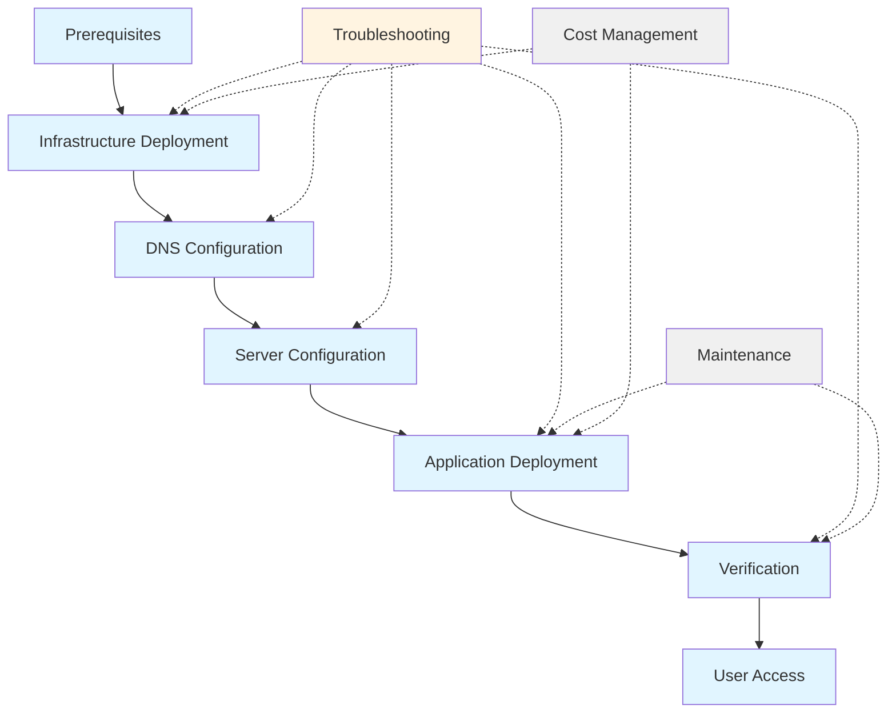

# Deployment Guide Design Document

## Overview

The deployment guide is a comprehensive markdown documentation artifact that guides operators through the complete process of deploying the AI Website Builder from source code to a fully operational AWS Lightsail instance. The guide serves multiple purposes: as a reference manual, a step-by-step tutorial, and a verification checklist.

The deployment guide is not executable code but rather structured documentation that must be clear, accurate, and actionable. It bridges the gap between the existing infrastructure code (Terraform/CloudFormation templates and shell scripts) and the operator who needs to deploy the system successfully.

### Key Design Principles

1. **Progressive Disclosure**: Information is presented in the order it's needed, with high-level overviews before detailed steps
2. **Verification-Driven**: Every major step includes verification commands and expected outputs
3. **Dual-Path Support**: Both Terraform and CloudFormation deployment paths are documented with clear guidance on choosing between them
4. **Troubleshooting-First**: Common issues are anticipated and solutions are provided inline, not just in a separate section
5. **Copy-Paste Ready**: All commands are formatted for direct execution with minimal modification

### Target Audience

- **Primary**: DevOps engineers and system administrators deploying the system for the first time
- **Secondary**: Developers who need to understand the deployment architecture
- **Tertiary**: End users who need access instructions after deployment

## Architecture

### Document Structure

The deployment guide follows a hierarchical structure that mirrors the deployment workflow:

```
Deployment Guide (DEPLOYMENT.md)
├── Introduction
│   ├── Purpose and Scope
│   ├── Time Estimates
│   └── Prerequisites Overview
├── Pre-Deployment Phase
│   ├── Prerequisites Checklist
│   ├── Tool Installation
│   ├── Credential Acquisition
│   └── Pre-Flight Verification
├── Infrastructure Deployment Phase
│   ├── Deployment Method Selection
│   ├── Terraform Path
│   │   ├── Configuration
│   │   ├── Execution
│   │   └── Output Verification
│   └── CloudFormation Path
│       ├── Configuration
│       ├── Execution
│       └── Output Verification
├── DNS Configuration Phase
│   ├── Domain Registration (if needed)
│   ├── DNS Record Configuration
│   ├── Propagation Verification
│   └── Pre-SSL Checks
├── Server Configuration Phase
│   ├── SSH Access Setup
│   ├── Script Execution Sequence
│   │   ├── NGINX Configuration
│   │   ├── UFW Firewall Setup
│   │   ├── Tailscale VPN Integration
│   │   ├── SSL Certificate Setup
│   │   └── Systemd Service Creation
│   └── Configuration Verification
├── Application Deployment Phase
│   ├── Code Transfer
│   ├── Dependency Installation
│   ├── Environment Configuration
│   ├── Build Process
│   └── Service Startup
├── Post-Deployment Verification Phase
│   ├── Component Health Checks
│   ├── Integration Testing
│   └── End-to-End Verification
├── User Access Instructions
│   ├── Tailscale Client Setup
│   ├── Builder Interface Access
│   └── Public Website Access
├── Troubleshooting Guide
│   ├── Infrastructure Issues
│   ├── Configuration Issues
│   ├── Application Issues
│   └── Network Issues
├── Maintenance Procedures
│   ├── Updates and Upgrades
│   ├── Backup and Restore
│   └── Monitoring
└── Cost Management
    ├── Cost Breakdown
    ├── Monitoring Tools
    └── Optimization Tips
```

### Information Flow

The guide follows a strict sequential flow where each phase depends on the successful completion of previous phases:

1. **Prerequisites** → Ensures all tools and credentials are available
2. **Infrastructure** → Creates the AWS resources
3. **DNS** → Configures domain routing (required for SSL)
4. **Server Configuration** → Configures the deployed instance
5. **Application** → Deploys and starts the application
6. **Verification** → Confirms everything works
7. **Access** → Enables user access

This dependency chain is made explicit through:
- Clear phase boundaries
- Verification checkpoints between phases
- Explicit statements about dependencies ("Before proceeding, ensure...")
- Rollback guidance when verification fails

### Documentation Format Standards

#### Command Blocks

All commands use fenced code blocks with language hints:

```bash
# Single command with comment
terraform init
```

```bash
# Multi-step sequence
cd terraform
cp terraform.tfvars.example terraform.tfvars
nano terraform.tfvars
```

#### Configuration Examples

Configuration files are shown with clear markers for user-supplied values:

```hcl
# terraform.tfvars
domain             = "yourdomain.com"              # REPLACE: Your domain
ssl_email          = "admin@yourdomain.com"        # REPLACE: Your email
anthropic_api_key  = "sk-ant-xxxxx"                # REPLACE: Your API key
```

#### Verification Patterns

Each verification follows a consistent pattern:

```markdown
**Verify [Component]**:
```bash
[verification command]
```

**Expected Output**:
```
[sample output showing success]
```

**If verification fails**: [troubleshooting steps]
```

#### Checklists

Interactive checklists use markdown checkbox syntax:

```markdown
- [ ] AWS CLI installed and configured
- [ ] Terraform installed (>= 1.0)
- [ ] Domain name registered
- [ ] Anthropic API key obtained
```

## Components and Interfaces

### Primary Components

#### 1. Prerequisites Section

**Purpose**: Ensure the operator has all necessary tools, credentials, and knowledge before beginning deployment.

**Structure**:
- Tool requirements with version specifications
- Installation instructions for each tool (OS-specific)
- Credential acquisition procedures with links
- Verification commands for each prerequisite
- Time estimate for the complete deployment

**Interface**: Provides a checklist that operators can mark off as they complete each item.

#### 2. Infrastructure Deployment Section

**Purpose**: Guide operators through provisioning AWS resources using either Terraform or CloudFormation.

**Structure**:
- Decision matrix for choosing between Terraform and CloudFormation
- Parallel documentation paths (one for each tool)
- Configuration file templates with inline comments
- Step-by-step execution commands
- Output interpretation guidance
- Verification procedures

**Interface**: Accepts operator's choice of deployment tool and provides tool-specific instructions.

#### 3. DNS Configuration Section

**Purpose**: Guide operators through domain name setup and DNS record configuration.

**Structure**:
- Domain registration guidance (for new domains)
- DNS provider-agnostic instructions
- A record configuration for root and www
- DNS propagation verification
- Pre-SSL verification checks

**Interface**: Provides commands that work with any DNS provider, with examples from common providers.

#### 4. Server Configuration Section

**Purpose**: Guide operators through executing the five configuration scripts in the correct order.

**Structure**:
- Script execution order with dependency explanations
- For each script:
  - Purpose and what it configures
  - Required parameters/environment variables
  - Execution command
  - Expected output
  - Verification command
  - Common issues and solutions

**Scripts Covered**:
1. `configure-nginx.sh` - Web server setup
2. `configure-ufw.sh` - Firewall rules
3. `configure-tailscale.sh` - VPN integration
4. `configure-ssl.sh` - SSL certificates
5. `configure-systemd.sh` - Service management

**Interface**: Provides copy-paste commands with placeholders for user-specific values.

#### 5. Application Deployment Section

**Purpose**: Guide operators through deploying the Node.js application code.

**Structure**:
- Code transfer methods (git clone vs scp)
- Dependency installation
- Environment file configuration
- Build process
- Service startup
- Log access

**Interface**: Provides commands for transferring code and starting services.

#### 6. Verification Section

**Purpose**: Provide a comprehensive checklist to verify all components are working correctly.

**Structure**:
- Component-by-component verification
- Integration tests
- End-to-end workflow test
- Performance checks
- Security verification

**Interface**: Provides test commands and expected results for each component.

#### 7. User Access Instructions

**Purpose**: Enable end users to access the deployed system.

**Structure**:
- Tailscale client installation (OS-specific)
- VPN connection procedure
- Builder Interface access URL format
- Public website access
- Troubleshooting connection issues

**Interface**: Provides step-by-step instructions for different operating systems.

#### 8. Troubleshooting Guide

**Purpose**: Help operators diagnose and resolve common deployment issues.

**Structure**:
- Organized by deployment phase
- Each issue includes:
  - Symptom description
  - Diagnostic commands
  - Root cause explanation
  - Solution steps
  - Prevention guidance

**Categories**:
- Infrastructure deployment failures
- SSH connection issues
- DNS propagation problems
- SSL certificate failures
- Firewall configuration issues
- Application startup failures
- VPN connectivity problems

**Interface**: Searchable by symptom or error message.

#### 9. Maintenance Section

**Purpose**: Document ongoing maintenance procedures.

**Structure**:
- Application update procedures
- Dependency updates
- Service restart procedures
- Backup procedures
- SSL certificate renewal monitoring
- Log rotation

**Interface**: Provides commands for common maintenance tasks.

#### 10. Cost Management Section

**Purpose**: Help operators understand and monitor deployment costs.

**Structure**:
- Detailed cost breakdown
- AWS Lightsail monitoring
- Claude API usage monitoring
- Cost optimization recommendations
- Budget alert setup

**Interface**: Provides monitoring commands and links to cost dashboards.

### Component Relationships



## Data Models

### Document Metadata

```typescript
interface DeploymentGuideMetadata {
  title: string;                    // "AI Website Builder - Deployment Guide"
  version: string;                  // Document version
  lastUpdated: string;              // ISO date
  targetAudience: string[];         // ["DevOps", "SysAdmin", "Developer"]
  estimatedTime: string;            // "60-90 minutes"
  difficulty: "beginner" | "intermediate" | "advanced";
}
```

### Prerequisite Item

```typescript
interface Prerequisite {
  name: string;                     // "AWS CLI"
  type: "tool" | "credential" | "knowledge";
  required: boolean;                // true for must-have, false for optional
  version?: string;                 // ">=2.0" for tools
  installationInstructions: {
    macos?: string;                 // Installation command for macOS
    linux?: string;                 // Installation command for Linux
    windows?: string;               // Installation command for Windows
  };
  verificationCommand: string;      // Command to verify installation
  expectedOutput: string;           // What successful verification looks like
  acquisitionUrl?: string;          // Where to get credentials
  estimatedTime: string;            // "5 minutes"
}
```

### Deployment Step

```typescript
interface DeploymentStep {
  id: string;                       // "infra-terraform-init"
  phase: string;                    // "Infrastructure Deployment"
  title: string;                    // "Initialize Terraform"
  description: string;              // What this step does
  prerequisites: string[];          // IDs of steps that must complete first
  commands: Command[];              // Commands to execute
  verification: Verification;       // How to verify success
  troubleshooting: TroubleshootingTip[];
  estimatedTime: string;            // "2 minutes"
  optional: boolean;                // Can this step be skipped?
}
```

### Command

```typescript
interface Command {
  syntax: string;                   // The actual command
  description: string;              // What the command does
  workingDirectory?: string;        // Where to run it
  requiresRoot: boolean;            // Whether sudo is needed
  parameters: Parameter[];          // User-supplied values
  expectedDuration: string;         // "30 seconds"
}
```

### Parameter

```typescript
interface Parameter {
  name: string;                     // "domain"
  placeholder: string;              // "yourdomain.com"
  description: string;              // "Your registered domain name"
  example: string;                  // "example.com"
  validation?: string;              // Regex or description of valid values
  source?: string;                  // Where to get this value
}
```

### Verification

```typescript
interface Verification {
  command: string;                  // Command to run
  expectedOutput: string;           // What success looks like
  expectedExitCode: number;         // Usually 0
  failureGuidance: string;          // What to do if verification fails
  alternativeChecks?: string[];     // Other ways to verify
}
```

### Troubleshooting Tip

```typescript
interface TroubleshootingTip {
  symptom: string;                  // "Error: No valid credential sources"
  diagnosticCommands: string[];     // Commands to diagnose the issue
  rootCause: string;                // Explanation of what's wrong
  solution: string;                 // How to fix it
  preventionTip?: string;           // How to avoid this in the future
  relatedIssues?: string[];         // Links to related problems
}
```

### Configuration File Template

```typescript
interface ConfigurationTemplate {
  filename: string;                 // "terraform.tfvars"
  format: "hcl" | "json" | "yaml" | "env";
  content: string;                  // Template content with placeholders
  parameters: Parameter[];          // Parameters that need values
  validationRules: ValidationRule[];
  exampleValues: Record<string, string>;
}
```

### Validation Rule

```typescript
interface ValidationRule {
  parameter: string;                // Which parameter this validates
  rule: string;                     // Description of the rule
  regex?: string;                   // Validation regex
  errorMessage: string;             // What to show if validation fails
}
```

### Deployment Path

```typescript
interface DeploymentPath {
  name: "terraform" | "cloudformation";
  description: string;              // When to use this path
  advantages: string[];             // Pros of this approach
  disadvantages: string[];          // Cons of this approach
  steps: DeploymentStep[];          // Steps specific to this path
  configurationFiles: ConfigurationTemplate[];
}
```

### Cost Item

```typescript
interface CostItem {
  service: string;                  // "AWS Lightsail Instance"
  category: "infrastructure" | "api" | "other";
  costType: "fixed" | "variable";
  amount: number;                   // Monthly cost in USD
  unit: string;                     // "per month", "per 1M tokens"
  monitoringCommand?: string;       // How to check current usage
  optimizationTips: string[];       // How to reduce costs
}
```

### Maintenance Task

```typescript
interface MaintenanceTask {
  name: string;                     // "Update Application Code"
  frequency: string;                // "As needed", "Monthly", "Weekly"
  estimatedTime: string;            // "10 minutes"
  commands: Command[];              // Commands to execute
  verification: Verification;       // How to verify success
  rollbackProcedure?: string;       // How to undo if something goes wrong
  automationPossible: boolean;      // Can this be automated?
}
```

### Document Section

```typescript
interface DocumentSection {
  id: string;                       // "prerequisites"
  title: string;                    // "Pre-Deployment Prerequisites"
  level: number;                    // Heading level (1-6)
  content: string;                  // Markdown content
  subsections: DocumentSection[];   // Nested sections
  checklistItems?: string[];        // Interactive checklist
  codeBlocks?: CodeBlock[];         // Code examples
  diagrams?: Diagram[];             // Visual aids
}
```

### Code Block

```typescript
interface CodeBlock {
  language: string;                 // "bash", "hcl", "json", etc.
  content: string;                  // The code
  caption?: string;                 // Description
  filename?: string;                // If showing file content
  highlightLines?: number[];        // Lines to emphasize
  copyable: boolean;                // Whether to show copy button
}
```

### Diagram

```typescript
interface Diagram {
  type: "mermaid" | "ascii" | "image";
  content: string;                  // Diagram definition or image URL
  caption: string;                  // Description
  altText: string;                  // Accessibility text
}
```

### Workflow Phase

```typescript
interface WorkflowPhase {
  name: string;                     // "Infrastructure Deployment"
  order: number;                    // Sequence in workflow
  estimatedTime: string;            // "15-20 minutes"
  canBeAutomated: boolean;          // Whether automation is possible
  requiresManualIntervention: boolean;
  dependencies: string[];           // Names of phases that must complete first
  steps: DeploymentStep[];          // Steps in this phase
  verificationChecklist: string[];  // What to verify before moving on
}
```

