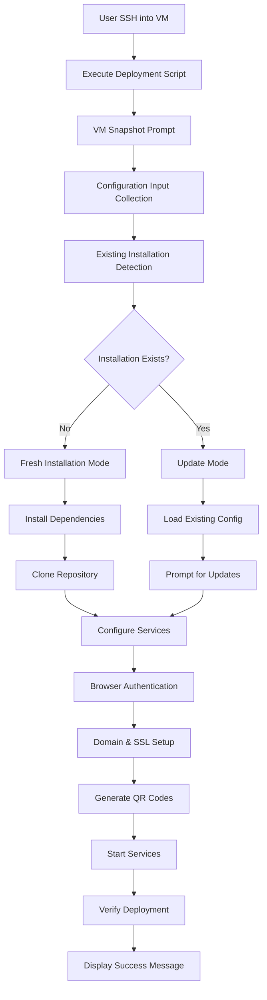

# Design Document: Quick Start Deployment

## Overview

The Quick Start Deployment System is a streamlined, automated deployment solution for the AI website builder on fresh Ubuntu VMs. The system is designed around a single-page guide and a single deployment script that handles all installation, configuration, and setup tasks with minimal user interaction.

The design prioritizes simplicity and reliability through:
- Interactive configuration collection at script start
- Idempotent operations that safely handle re-runs
- Browser-based authentication support for OAuth flows
- QR code generation for easy end-user access via Tailscale
- Automatic service management with systemd
- Secure credential storage with proper file permissions
- Update mode for modifying configuration without full redeployment

The deployment assumes users have already provisioned an Ubuntu VM, registered a domain, obtained a Claude API key, and created a Tailscale account. The script begins execution when the user is logged into the VM as root via SSH.

## Architecture

### High-Level Architecture



### Component Architecture

The system consists of three primary components:

1. **Quick Start Guide** (static documentation)
   - Single-page markdown/HTML document
   - Prerequisites checklist
   - Script download and execution instructions
   - QR code usage explanation
   - Troubleshooting tips

2. **Deployment Script** (bash script)
   - Configuration input handler
   - Installation mode detector
   - Dependency installer
   - Service configurator
   - Authentication flow manager
   - QR code generator
   - Service manager

3. **Configuration Store** (file-based)
   - Secure credential storage
   - Installation state tracking
   - Service configuration files
   - Generated QR code images

### Execution Flow

The deployment script follows a linear execution model with checkpoints:

1. **Pre-flight Phase**: VM snapshot prompt, existing installation detection
2. **Input Phase**: Interactive configuration collection with validation
3. **Installation Phase**: Dependency installation, repository cloning
4. **Configuration Phase**: Service setup, credential storage, domain configuration
5. **Authentication Phase**: Browser-based OAuth flows (Tailscale, etc.)
6. **Finalization Phase**: QR code generation, service startup, verification
7. **Completion Phase**: Success message display with access instructions

Each phase is designed to be idempotent and resumable in case of failures.

## Components and Interfaces

### 1. Quick Start Guide Component

**Purpose**: Provide concise, single-page documentation for the deployment process.

**Structure**:
- Prerequisites section (VM, domain, API key, Tailscale account)
- One-line script download and execution command
- Expected prompts and inputs explanation
- QR code usage instructions for end users
- Troubleshooting common issues

**Format**: Markdown file that can be rendered as HTML or viewed in terminal

**Location**: Hosted in repository root as `QUICKSTART.md`

### 2. Deployment Script Component

**Purpose**: Automate the complete installation and configuration process.

**File**: `deploy.sh` (bash script)

**Key Functions**:

```bash
# Main entry point
main()

# Pre-flight checks
prompt_vm_snapshot()
detect_existing_installation()

# Configuration management
collect_configuration_input()
validate_configuration()
load_existing_configuration()
save_configuration()
mask_sensitive_values()

# Installation operations
install_system_dependencies()
install_runtime_dependencies()
install_tailscale()
clone_repository()
configure_firewall()

# Service configuration
configure_web_server()
setup_ssl_certificates()
configure_systemd_service()

# Authentication flows
handle_browser_authentication()
wait_for_auth_completion()

# QR code generation
generate_qr_codes()
save_qr_code_images()
display_qr_codes_terminal()

# Service management
start_services()
verify_service_status()
restart_services()

# Utilities
log_operation()
display_progress()
handle_error()
verify_domain_accessibility()
```

**Interfaces**:
- **Input**: Interactive prompts via stdin
- **Output**: Progress messages, QR codes, success/error messages via stdout
- **Logging**: Detailed operation log to `/var/log/ai-website-builder-deploy.log`
- **Configuration**: Reads/writes to `/etc/ai-website-builder/config.env`
- **State**: Tracks installation state in `/etc/ai-website-builder/.install-state`

### 3. Configuration Input Handler

**Purpose**: Collect and validate user-provided configuration values.

**Required Inputs**:
- Claude API key (string, validated format)
- Domain name (FQDN, validated DNS format)
- Tailscale account email (email format)

**Validation Rules**:
- Claude API key: Non-empty, starts with expected prefix
- Domain name: Valid FQDN format, resolvable DNS
- Email: Valid email format

**Behavior**:
- Prompt for each value sequentially
- Display current value in update mode (masked for sensitive data)
- Allow user to press Enter to keep existing value in update mode
- Re-prompt on validation failure with descriptive error
- Store validated values in memory until all inputs collected

### 4. Installation Mode Detector

**Purpose**: Determine if this is a fresh installation or an update.

**Detection Logic**:
```bash
if [ -f "/etc/ai-website-builder/.install-state" ]; then
    MODE="update"
    load_existing_configuration
else
    MODE="fresh"
fi
```

**State File Format** (`/etc/ai-website-builder/.install-state`):
```
INSTALL_DATE=2024-01-15T10:30:00Z
INSTALL_VERSION=1.0.0
LAST_UPDATE=2024-01-15T10:30:00Z
REPOSITORY_PATH=/opt/ai-website-builder
```

### 5. Dependency Installer

**Purpose**: Install all required system and runtime dependencies.

**System Dependencies** (via apt):
- `curl`, `wget`, `git`
- `nginx` (web server)
- `certbot` (SSL certificates)
- `qrencode` (QR code generation)
- `ufw` (firewall)

**Runtime Dependencies**:
- Node.js (LTS version via NodeSource repository)
- npm packages (from repository package.json)

**Tailscale Installation**:
- Add Tailscale package repository
- Install tailscale package
- Enable and start tailscaled service

**Update Mode Behavior**:
- Run `apt update && apt upgrade -y` for security updates
- Update npm dependencies with `npm update`
- Check for Tailscale updates

### 6. Browser Authentication Manager

**Purpose**: Handle OAuth and browser-based authentication flows.

**Flow**:
1. Detect when authentication URL is available (from Tailscale CLI output)
2. Display clickable URL to user
3. Display instructions: "Please open this URL in your browser to authenticate"
4. Poll for authentication completion (check Tailscale status)
5. Timeout after 5 minutes with retry option
6. Continue deployment on successful authentication

**Implementation**:
```bash
handle_browser_authentication() {
    local auth_url=$1
    echo "━━━━━━━━━━━━━━━━━━━━━━━━━━━━━━━━━━━━━━━━━━━━━━━"
    echo "Browser authentication required"
    echo "Please open this URL: $auth_url"
    echo "━━━━━━━━━━━━━━━━━━━━━━━━━━━━━━━━━━━━━━━━━━━━━━━"
    
    wait_for_auth_completion 300  # 5 minute timeout
}
```

### 7. QR Code Generator

**Purpose**: Generate QR codes for Tailscale app installation and service access.

**Generated QR Codes**:
1. **Tailscale App Store Link**: Directs to app store for mobile installation
2. **Service Access URL**: Direct link to AI website builder interface via Tailscale

**Implementation**:
- Use `qrencode` command-line tool
- Generate ASCII art QR codes for terminal display
- Save PNG images to `/etc/ai-website-builder/qr-codes/`
- Display both QR codes in final success message

**Terminal Display Format**:
```
┌─────────────────────────────────────┐
│  Scan to install Tailscale app      │
│                                     │
│  [ASCII QR CODE]                    │
│                                     │
└─────────────────────────────────────┘
```

### 8. Service Manager

**Purpose**: Configure and manage the AI website builder as a systemd service.

**Systemd Unit File** (`/etc/systemd/system/ai-website-builder.service`):
```ini
[Unit]
Description=AI Website Builder
After=network.target tailscaled.service
Requires=tailscaled.service

[Service]
Type=simple
User=www-data
WorkingDirectory=/opt/ai-website-builder
EnvironmentFile=/etc/ai-website-builder/config.env
ExecStart=/usr/bin/node server.js
Restart=always
RestartSec=10

[Install]
WantedBy=multi-user.target
```

**Service Operations**:
- Enable service: `systemctl enable ai-website-builder`
- Start service: `systemctl start ai-website-builder`
- Restart service: `systemctl restart ai-website-builder`
- Check status: `systemctl status ai-website-builder`

**Verification**:
- Check service status after start
- Verify process is running
- Check service logs for errors
- Test HTTP endpoint accessibility

### 9. Secure Configuration Store

**Purpose**: Store credentials and configuration securely.

**Configuration File** (`/etc/ai-website-builder/config.env`):
```bash
CLAUDE_API_KEY=sk-ant-xxxxx
DOMAIN_NAME=example.com
TAILSCALE_EMAIL=user@example.com
INSTALL_DATE=2024-01-15T10:30:00Z
```

**Security Measures**:
- File permissions: `600` (owner read/write only)
- Owner: `root:root`
- Directory permissions: `700` for `/etc/ai-website-builder/`
- No credentials in process arguments or logs
- Masked display in update mode (show only last 4 characters)

**Masking Function**:
```bash
mask_value() {
    local value=$1
    local visible_chars=4
    local masked_length=$((${#value} - visible_chars))
    printf '%*s' "$masked_length" | tr ' ' '*'
    echo "${value: -visible_chars}"
}
```

### 10. Domain and SSL Configuration

**Purpose**: Configure domain name and SSL/TLS certificates.

**Nginx Configuration** (`/etc/nginx/sites-available/ai-website-builder`):
```nginx
server {
    listen 80;
    server_name DOMAIN_NAME;
    
    location /.well-known/acme-challenge/ {
        root /var/www/certbot;
    }
    
    location / {
        return 301 https://$server_name$request_uri;
    }
}

server {
    listen 443 ssl http2;
    server_name DOMAIN_NAME;
    
    ssl_certificate /etc/letsencrypt/live/DOMAIN_NAME/fullchain.pem;
    ssl_certificate_key /etc/letsencrypt/live/DOMAIN_NAME/privkey.pem;
    
    location / {
        proxy_pass http://localhost:3000;
        proxy_set_header Host $host;
        proxy_set_header X-Real-IP $remote_addr;
    }
}
```

**SSL Certificate Acquisition**:
```bash
certbot certonly --nginx \
    --non-interactive \
    --agree-tos \
    --email $TAILSCALE_EMAIL \
    -d $DOMAIN_NAME
```

**Domain Verification**:
- Check DNS resolution: `dig +short $DOMAIN_NAME`
- Verify HTTP accessibility: `curl -I http://$DOMAIN_NAME`
- Verify HTTPS accessibility: `curl -I https://$DOMAIN_NAME`

## Data Models

### Configuration Data Model

```typescript
interface DeploymentConfiguration {
    claudeApiKey: string;        // Claude API key for AI functionality
    domainName: string;          // Fully qualified domain name
    tailscaleEmail: string;      // Email for Tailscale account
    installDate: string;         // ISO 8601 timestamp
    lastUpdate?: string;         // ISO 8601 timestamp (update mode only)
    repositoryPath: string;      // Path to cloned repository
    version: string;             // Deployment script version
}
```

### Installation State Model

```typescript
interface InstallationState {
    mode: 'fresh' | 'update';
    installDate: string;
    lastUpdate: string;
    version: string;
    repositoryPath: string;
    servicesConfigured: string[];  // List of configured services
    dependenciesInstalled: boolean;
    sslConfigured: boolean;
    tailscaleConfigured: boolean;
}
```

### QR Code Data Model

```typescript
interface QRCodeData {
    type: 'app-store' | 'service-access';
    url: string;
    filename: string;            // PNG file path
    asciiArt: string;           // Terminal display representation
    generatedAt: string;        // ISO 8601 timestamp
}
```

### Service Status Model

```typescript
interface ServiceStatus {
    name: string;
    active: boolean;
    enabled: boolean;
    pid?: number;
    uptime?: string;
    lastError?: string;
}
```

### Validation Result Model

```typescript
interface ValidationResult {
    valid: boolean;
    field: string;
    value: string;
    error?: string;
}
```

### Deployment Result Model

```typescript
interface DeploymentResult {
    success: boolean;
    mode: 'fresh' | 'update';
    timestamp: string;
    servicesStarted: string[];
    qrCodes: QRCodeData[];
    accessUrl: string;
    errors: string[];
    warnings: string[];
}
```


## Correctness Properties

A property is a characteristic or behavior that should hold true across all valid executions of a system—essentially, a formal statement about what the system should do. Properties serve as the bridge between human-readable specifications and machine-verifiable correctness guarantees.

### Property 1: Configuration Input Validation

For any configuration input (Claude API key, domain name, Tailscale email), if the input is invalid according to the validation rules, the script shall reject it, display a descriptive error message, and re-prompt for that input.

**Validates: Requirements 3.4, 3.5**

### Property 2: Installation Mode Detection

For any system state, if an installation state file exists at `/etc/ai-website-builder/.install-state`, the script shall detect it and enter update mode; otherwise, it shall enter fresh installation mode.

**Validates: Requirements 5.1**

### Property 3: Configuration Preservation in Update Mode

For any configuration value in update mode, if the user does not provide a new value (presses Enter), the existing value shall remain unchanged in the configuration file.

**Validates: Requirements 5.3, 5.4, 5.5**

### Property 4: QR Code File Persistence

For any generated QR code (app store link or service access URL), the script shall save it as a PNG image file in `/etc/ai-website-builder/qr-codes/` with a filename corresponding to its type.

**Validates: Requirements 6.4**

### Property 5: Operation Logging

For any operation performed by the deployment script (installation, configuration, service management), an entry shall be written to the log file at `/var/log/ai-website-builder-deploy.log`.

**Validates: Requirements 7.4**

### Property 6: Progress Indication for Long Operations

For any operation that takes longer than 5 seconds (dependency installation, repository cloning, SSL certificate acquisition), the script shall display a progress indicator or status message.

**Validates: Requirements 7.3**

### Property 7: Deployment Idempotency

For any valid configuration, executing the deployment script multiple times shall produce the same end state: the same services running, the same configuration values stored, and the same files present.

**Validates: Requirements 8.1, 8.2, 8.3, 8.5**

### Property 8: Safe Resumption After Partial Failure

For any deployment that fails at step N, re-running the script shall safely resume by detecting completed steps and continuing from step N or a safe checkpoint before it, without duplicating resources or corrupting state.

**Validates: Requirements 8.4**

### Property 9: Credential File Security

For any file containing sensitive credentials (API keys, authentication tokens), the script shall set file permissions to 600 (owner read/write only) and ownership to root:root.

**Validates: Requirements 11.3**

### Property 10: Credential Logging Protection

For any sensitive credential value (Claude API key, Tailscale auth token), the script shall not write it to the log file in plain text; if logging is necessary, the value shall be masked.

**Validates: Requirements 11.4**

### Property 11: Credential Display Masking

For any sensitive configuration value displayed in update mode, the script shall mask all but the last 4 characters (e.g., "sk-ant-***************xyz").

**Validates: Requirements 11.5**

### Property 12: Error Remediation Guidance

For any error that occurs during deployment (dependency installation failure, domain configuration failure, service start failure), the script shall display an error message that includes specific remediation steps or troubleshooting guidance.

**Validates: Requirements 7.5, 9.7, 10.4, 13.5**


## Error Handling

### Error Categories

The deployment script handles four categories of errors:

1. **Pre-flight Errors**: Issues detected before installation begins
   - Missing prerequisites (not running as root, wrong OS)
   - Insufficient disk space or memory
   - Network connectivity issues

2. **Input Validation Errors**: Invalid configuration values
   - Malformed API keys
   - Invalid domain names
   - Invalid email addresses

3. **Installation Errors**: Failures during dependency installation or configuration
   - Package installation failures
   - Repository clone failures
   - Service configuration failures

4. **Runtime Errors**: Issues with starting or verifying services
   - Service start failures
   - Domain accessibility failures
   - Authentication timeout

### Error Handling Strategy

**Validation Errors**:
- Display specific error message explaining what's wrong
- Re-prompt for the invalid input
- Provide example of valid format
- Allow unlimited retry attempts

**Installation Errors**:
- Log detailed error information to log file
- Display user-friendly error message with context
- Provide specific remediation steps
- Exit with non-zero status code
- Preserve partial state for safe resumption

**Authentication Errors**:
- Display authentication URL clearly
- Wait with timeout (5 minutes)
- Provide retry option on timeout
- Allow manual continuation if authentication completed out-of-band

**Service Errors**:
- Display service status and recent logs
- Provide troubleshooting steps
- Suggest checking log file for details
- Exit with non-zero status code

### Error Message Format

All error messages follow this structure:

```
━━━━━━━━━━━━━━━━━━━━━━━━━━━━━━━━━━━━━━━━━━━━━━━
❌ ERROR: [Brief description]
━━━━━━━━━━━━━━━━━━━━━━━━━━━━━━━━━━━━━━━━━━━━━━━

Details: [Detailed explanation of what went wrong]

Remediation:
  1. [First step to fix the issue]
  2. [Second step to fix the issue]
  3. [Additional steps as needed]

For more information, check the log file:
  /var/log/ai-website-builder-deploy.log

━━━━━━━━━━━━━━━━━━━━━━━━━━━━━━━━━━━━━━━━━━━━━━━
```

### Rollback Strategy

The script does not implement automatic rollback. Instead, it relies on:

1. **VM Snapshots**: Users are prompted to create snapshots before deployment
2. **Idempotent Operations**: Re-running the script safely handles partial failures
3. **State Preservation**: Failed deployments preserve state for manual recovery
4. **Detailed Logging**: Complete operation logs enable manual troubleshooting

### Timeout Handling

**Authentication Timeout**:
- Default: 5 minutes
- Behavior: Display timeout message, offer retry
- User can manually verify authentication and continue

**Network Operation Timeout**:
- Repository clone: 10 minutes
- Package download: 5 minutes per package
- Domain verification: 2 minutes
- Behavior: Display timeout error, suggest checking network connectivity

## Testing Strategy

### Overview

The Quick Start Deployment System requires a dual testing approach combining unit tests for specific scenarios and property-based tests for universal behaviors. This ensures both concrete functionality and general correctness across varied inputs and system states.

### Testing Approach

**Unit Tests**: Verify specific examples, edge cases, and integration points
- Specific configuration input scenarios
- Specific error conditions
- Integration between components
- Specific deployment scenarios (fresh install, update mode)

**Property-Based Tests**: Verify universal properties across all inputs
- Configuration validation across random inputs
- Idempotency across multiple runs
- Security properties across all credential types
- Error handling across all failure modes

### Property-Based Testing Configuration

**Framework**: We will use [BATS (Bash Automated Testing System)](https://github.com/bats-core/bats-core) with custom property test helpers for bash script testing.

**Test Configuration**:
- Minimum 100 iterations per property test
- Each property test references its design document property
- Tag format: `# Feature: quick-start-deployment, Property {number}: {property_text}`

**Property Test Implementation Pattern**:

```bash
# Feature: quick-start-deployment, Property 1: Configuration Input Validation
@test "property: invalid configuration inputs are rejected and re-prompted" {
    for i in {1..100}; do
        # Generate random invalid input
        invalid_input=$(generate_invalid_config_input)
        
        # Run validation
        result=$(validate_configuration_input "$invalid_input")
        
        # Assert rejection
        [ "$result" = "invalid" ]
    done
}
```

### Unit Test Coverage

**Configuration Input Tests**:
- Valid Claude API key format accepted
- Valid domain name format accepted
- Valid email format accepted
- Empty input rejected
- Malformed input rejected

**Installation Mode Tests**:
- Fresh installation when no state file exists
- Update mode when state file exists
- State file correctly parsed
- Invalid state file handled gracefully

**Update Mode Tests**:
- Existing configuration loaded correctly
- User can update individual values
- Pressing Enter preserves existing value
- Services restarted after configuration update

**QR Code Generation Tests**:
- App store QR code generated
- Service access QR code generated
- QR codes saved as PNG files
- QR codes displayed in terminal
- QR codes contain correct URLs

**Service Management Tests**:
- Systemd service file created
- Service enabled for auto-start
- Service started successfully
- Service status verified
- Service logs accessible

**Security Tests**:
- Configuration file has 600 permissions
- Configuration directory has 700 permissions
- Credentials not in log file
- Credentials masked in update mode display

**Error Handling Tests**:
- Invalid input shows error and re-prompts
- Dependency failure shows specific package
- Service failure shows logs
- Authentication timeout handled gracefully

### Property-Based Test Coverage

Each correctness property from the design document shall be implemented as a property-based test:

**Property 1: Configuration Input Validation**
- Generate 100+ random invalid inputs per field type
- Verify all are rejected with error messages
- Verify re-prompting occurs

**Property 2: Installation Mode Detection**
- Test with various state file conditions
- Verify correct mode selection in all cases

**Property 3: Configuration Preservation in Update Mode**
- Generate random existing configurations
- Simulate user pressing Enter for random fields
- Verify those fields remain unchanged

**Property 4: QR Code File Persistence**
- Generate random QR code data
- Verify files created for all generated codes

**Property 5: Operation Logging**
- Run random sequences of operations
- Verify all operations logged

**Property 6: Progress Indication for Long Operations**
- Simulate operations of varying durations
- Verify progress shown for operations >5 seconds

**Property 7: Deployment Idempotency**
- Run deployment with random valid configurations
- Run again with same configuration
- Verify identical end state

**Property 8: Safe Resumption After Partial Failure**
- Simulate failures at random steps
- Re-run deployment
- Verify safe resumption without duplication

**Property 9: Credential File Security**
- Create random credential files
- Verify all have 600 permissions

**Property 10: Credential Logging Protection**
- Generate random credential values
- Verify none appear in logs unmasked

**Property 11: Credential Display Masking**
- Generate random credential values
- Verify all displayed values are masked correctly

**Property 12: Error Remediation Guidance**
- Simulate random error conditions
- Verify all error messages include remediation steps

### Integration Testing

**End-to-End Fresh Installation**:
1. Start with clean Ubuntu VM
2. Run deployment script with valid inputs
3. Verify all services running
4. Verify domain accessible
5. Verify QR codes generated
6. Verify configuration stored securely

**End-to-End Update Mode**:
1. Start with existing installation
2. Run deployment script with updated configuration
3. Verify configuration updated
4. Verify services restarted
5. Verify no data loss

**Authentication Flow Testing**:
1. Run deployment requiring browser authentication
2. Verify URL displayed
3. Complete authentication in browser
4. Verify deployment continues
5. Verify authentication persisted

### Test Environment

**Requirements**:
- Fresh Ubuntu 22.04 LTS VM for each test run
- Root access
- Network connectivity
- Valid test credentials (non-production)

**Test Isolation**:
- Each test runs in isolated VM or container
- State cleaned between tests
- No shared state between test runs

### Continuous Testing

**Pre-commit Tests**:
- Unit tests for modified functions
- Linting and syntax validation

**CI/CD Pipeline Tests**:
- Full unit test suite
- Property-based tests (100 iterations)
- Integration tests on clean VM
- Security validation tests

**Release Tests**:
- Full property-based tests (1000 iterations)
- End-to-end deployment on multiple cloud providers
- Update mode testing on existing installations
- Performance and timeout testing

